# ONECore — Arkitekturöversikt

Den här sidan beskriver hur ONECores applikationer, tjänster och externa integrationer hänger ihop. Syftet är dubbelt: ge en övergripande bild av lösningen, och fungera som stöd vid felsökning — om något är trasigt, använd diagrammet och tabellerna nedan för att hitta rätt tjänst och rätt externa system snabbare.

Det här dokumentet beskriver **applikations- och integrationsarkitekturen** (vad pratar med vad, och varför). Klusteruppsättning, DNS och nätverkstopologi beskrivs istället i respektive drift-repo — se länkar under [Drift och nätverk](#drift-och-nätverk) längst ner, för att undvika att samma information underhålls på två ställen. Se [TROUBLESHOOTING.md](./TROUBLESHOOTING.md) för hur man kontrollerar status och spårar ett specifikt fel vid en incident.

> Ersätter en äldre, ej versionshanterad arkitekturskiss som saknade Tenfast, Economy, Contacts, Keys, Work Order och Inspection helt. Den här versionen är härledd direkt ur koden (`core/src/adapters/`, varje tjänsts `adapters/`-mappar) och korsverifierad mot integrationslistan som delats med förvaltningsforum, 2026-09-29.

## Grundregeln

**Core är den enda tjänst som pratar med övriga ONECore-tjänster.** Frontend-applikationerna anropar Core, aldrig tjänsterna direkt.

- `internal-portal` har ett eget litet Koa-backend (BFF) som anropar Core.
- `property-tree` och `keys-portal` saknar eget backend — deras frontend anropar Core:s API direkt.

**Rena UI-länkar, inte ett Core-kringgående** (viktigt att skilja från riktig datatrafik vid felsökning): `property-tree` har en "Visa i EcoGuard Curves"-länk och `keys-portal` länkar ut till Alliera/DAX och till property-tree — alla tre är bara klickbara `<a href>`-länkar till respektive systems egna gränssnitt, ingen av dem hämtar data. Den faktiska lägenhetstemperatur-datan property-tree visar hämtas via Core → Property-tjänsten → Ecoguard, precis enligt grundregeln — se diagrammet.

## Diagram

```mermaid
flowchart TD
    subgraph Apps["Applikationer"]
        PT["property-tree<br/>(inget eget backend)"]
        KP["keys-portal<br/>(inget eget backend)"]
        IP["internal-portal<br/>(eget backend/BFF)"]
    end

    CORE["Core<br/>(orkestrering)"]

    subgraph Services["Tjänster"]
        LEASING["Leasing"]
        ECONOMY["Economy"]
        CONTACTS["Contacts"]
        COMM["Communication"]
        PROP["Property"]
        PROPMGMT["Property Management"]
        INSPECT["Inspection"]
        WORKORDER["Work Order"]
        KEYS["Keys"]
        FILESTORAGE["File Storage"]
    end

    subgraph External["Externa system"]
        XPAND_SOAP["Xpand SOAP"]
        XPAND_DB[("Xpand SQL DB<br/>Mimer_Summarum_DB")]
        TENFAST["Tenfast"]
        CREDITSAFE["Creditsafe"]
        XLEDGER["Xledger (GraphQL)"]
        STRALFORS["Strålfors (SFTP)"]
        SERGEL["Sergel (SFTP)"]
        MALARENERGI["Mälarenergi (SFTP)"]
        INFOBIP["Infobip"]
        ODOO["Odoo"]
        LINEAR["Linear"]
        DAX["DAX / Alliera"]
        SIMPLESIGN["Simplesign"]
        MINIO[("MinIO / S3")]
        AKTIVBO["AktivBo"]
        ECOGUARD["Ecoguard Curves"]
        MSGRAPH["Microsoft Graph / Entra ID"]
        POWERAUTOMATE["Power Automate<br/>+ kvittensskannrar"]
        LANSFORSAKRINGAR["Länsförsäkringar (SFTP)"]
    end

    PT --> CORE
    KP --> CORE
    IP --> CORE

    CORE --> LEASING
    CORE --> ECONOMY
    CORE --> CONTACTS
    CORE --> COMM
    CORE --> PROP
    CORE --> PROPMGMT
    CORE --> INSPECT
    CORE --> WORKORDER
    CORE --> KEYS
    CORE --> FILESTORAGE
    CORE --> MSGRAPH
    CORE -.->|"legacy, avvecklas"| LANSFORSAKRINGAR

    LEASING --> XPAND_SOAP
    LEASING --> XPAND_DB
    LEASING --> TENFAST
    LEASING --> CREDITSAFE

    ECONOMY --> XPAND_DB
    ECONOMY --> TENFAST
    ECONOMY --> XLEDGER
    ECONOMY --> STRALFORS
    ECONOMY --> SERGEL
    ECONOMY --> MALARENERGI
    ECONOMY --> INFOBIP

    CONTACTS --> XPAND_DB

    COMM --> INFOBIP
    COMM --> LINEAR

    PROP --> XPAND_DB
    PROP --> ECOGUARD

    PROPMGMT --> XPAND_SOAP
    PROPMGMT --> XPAND_DB

    INSPECT --> XPAND_DB

    WORKORDER --> ODOO
    WORKORDER -->|"historiska ärenden"| XPAND_DB

    KEYS --> DAX
    KEYS --> SIMPLESIGN

    FILESTORAGE --> MINIO

    TENFAST -.->|"in: kontaktuppslag"| CORE
    ODOO -.->|"in: hyresgäster/hyresobjekt"| CORE
    AKTIVBO -.->|"in: aktiva hyresgäster"| CORE
    SIMPLESIGN -.->|"in: webhook, signeringssvar"| KEYS
    POWERAUTOMATE -.->|"in: kvittensfil, WebDAV PUT"| CORE
    INFOBIP -.->|"in: leveransstatus, 2 webhooks"| CORE

    PT -.->|"extern länk, UI endast"| ECOGUARD
    KP -.->|"extern länk"| DAX
    KP -.->|"extern länk"| PT
```

## Tjänster

| Tjänst                  | Vad den gör                                                                 | Externa system                                                        | Egen databas                                                                                                       |
| ----------------------- | --------------------------------------------------------------------------- | --------------------------------------------------------------------- | ------------------------------------------------------------------------------------------------------------------ |
| **Leasing**             | Uthyrningsprocesser: bilplatser, avtal                                      | Xpand (SOAP + DB), Tenfast, Creditsafe                                | Ja                                                                                                                 |
| **Economy**             | Fakturering, avisering, bokföringsexport                                    | Xpand (DB), Tenfast, Xledger, Strålfors, Sergel, Mälarenergi, Infobip | Ja                                                                                                                 |
| **Contacts**            | Kontakt-/hyresgästdata (ersätter delar av direkta Xpand-anrop från Leasing) | Xpand (DB)                                                            | Ja                                                                                                                 |
| **Communication**       | E-post/SMS-utskick, ärendehantering                                         | Infobip, Linear                                                       | Ja                                                                                                                 |
| **Property**            | Fastighetsdata (läser Xpand direkt via Prisma)                              | Xpand (DB)                                                            | Delvis — läser mest Xpands egen DB, men äger egna `Onecore*`-tabeller (kostnadsställe, KVV-område) i samma databas |
| **Property Management** | Fastighetsförvaltning                                                       | Xpand (SOAP + DB)                                                     | Ja                                                                                                                 |
| **Inspection**          | Besiktningar                                                                | Xpand (DB)                                                            | Ja                                                                                                                 |
| **Work Order**          | Ärenden/felanmälan (nya i Odoo, historiska lästa direkt ur Xpand)           | Odoo, Xpand (DB, läs)                                                 | Nej*                                                                                                               |
| **Keys**                | Nyckelhantering, kvittenser                                                 | DAX/Alliera, Simplesign                                               | Ja                                                                                                                 |
| **File Storage**        | Fillagring                                                                  | MinIO/S3                                                              | Nej                                                                                                                |

`*` Ingen egen migrations-mapp hittad — bekräfta om Work Order är avsiktligt databaslös eller om det är en lucka.

## Externa system

| System                                | Används av                                                                        | Riktning                                        | Syfte                                                                                                                                                            |
| ------------------------------------- | --------------------------------------------------------------------------------- | ----------------------------------------------- | ---------------------------------------------------------------------------------------------------------------------------------------------------------------- |
| **Xpand** (SOAP + SQL DB)             | Leasing, Economy, Contacts, Property, Property Management, Inspection, Work Order | Ut (läs), delvis SOAP-skrivning i Leasing       | Legacy fastighets-/kontraktssystem, fortsatt källa för mycket grunddata (Work Order läser bara historiska, förmigrerade ärenden)                                 |
| **Tenfast**                           | Leasing, Economy                                                                  | Ut + in (kontaktuppslag)                        | Avtals-/bilplatshantering                                                                                                                                        |
| **Creditsafe**                        | Leasing                                                                           | Ut                                              | Kreditupplysning                                                                                                                                                 |
| **Xledger**                           | Economy                                                                           | Ut                                              | Bokföring, fakturor, betalstatus                                                                                                                                 |
| **Strålfors**                         | Economy                                                                           | Ut (SFTP)                                       | Fakturadistribution (tryck/digitalt)                                                                                                                             |
| **Sergel**                            | Economy                                                                           | Ut (SFTP)                                       | Inkasso                                                                                                                                                          |
| **Mälarenergi**                       | Economy                                                                           | Ut (SFTP)                                       | Fakturor                                                                                                                                                         |
| **Infobip**                           | Economy, Communication                                                            | Ut + in (2 webhooks: leveransstatus SMS/e-post) | E-post/SMS                                                                                                                                                       |
| **Odoo**                              | Work Order                                                                        | Ut + in                                         | Ärendehantering                                                                                                                                                  |
| **Linear**                            | Communication                                                                     | Ut                                              | Ärendehantering/ticketing                                                                                                                                        |
| **DAX / Alliera**                     | Keys                                                                              | Ut                                              | Nyckelkvittenser                                                                                                                                                 |
| **Simplesign**                        | Keys                                                                              | Ut + in (webhook)                               | E-signering                                                                                                                                                      |
| **MinIO / S3**                        | File Storage                                                                      | Ut                                              | Fillagring                                                                                                                                                       |
| **AktivBo**                           | Core (direkt)                                                                     | In                                              | Aktiva hyresgäster/bostadsinfo — ren API-konsument av Cores redan existerande endpoints, inget AktivBo-specifikt i koden (därför ingen egen adapter att peka på) |
| **Ecoguard Curves**                   | Property (via Core)                                                               | Ut                                              | Lägenhetstemperaturer. property-tree har även en ren UI-länk ut till Ecoguards eget gränssnitt, hämtar ingen data                                                |
| **Microsoft Graph / Entra ID**        | Core (direkt)                                                                     | Ut                                              | Autentisering                                                                                                                                                    |
| **Länsförsäkringar**                  | Core (direkt, `home-insurance-export`-scriptet)                                   | Ut (SFTP)                                       | Hemförsäkringsexport — **legacy, avvecklas** (hanteras numera i Xpand)                                                                                           |
| **Power Automate + kvittensskannrar** | Core (direkt)                                                                     | In (WebDAV PUT, IP-listad)                      | Kvittensskanning (plan 5, KC) — skannrarna skjuter in filer i Core, IP-allowlistat                                                                               |

## Drift och nätverk

Klusteruppsättning, miljömodell, CoreDNS och nätverkstopologi hör hemma i respektive drift-repo, inte här:

- `mimer-onecore-operations/README.md` — arkitekturöversikt (infra-verktyg, appplattformar, miljömodell)
- `mimer-onecore-operations-production/README.md` — CoreDNS-förklaring, runbook för ny applikation, per-tjänst secrets
