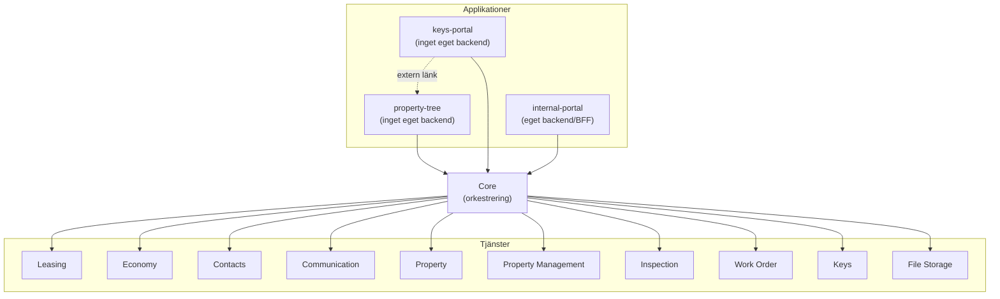

# ONECore — Arkitekturöversikt

Den här sidan beskriver hur ONECores applikationer och tjänster hänger ihop. Syftet är att ge en övergripande bild av lösningen och hjälpa till att snabbt hitta rätt tjänst vid felsökning.

Det här dokumentet beskriver **den interna tjänstearkitekturen** (vilka tjänster finns, vad de gör, hur de hänger ihop). Externa integrationer (vilka system ONECore pratar med, riktning, syfte) och felsökning/incidenthantering hör ihop med drift och beskrivs istället i `mimer-onecore-operations` — se [Externa system och drift](#externa-system-och-drift) längst ner, för att undvika att drifts-/säkerhetskänslig information (bl.a. vilka integrationer som är inkommande) hamnar i det här publika repot.

> Ersätter en äldre, ej versionshanterad arkitekturskiss som saknade Tenfast, Economy, Contacts, Keys, Work Order och Inspection helt. Den här versionen är härledd direkt ur koden (`core/src/adapters/`, varje tjänsts `adapters/`-mappar).

## Grundregeln

**Core är den enda tjänst som pratar med övriga ONECore-tjänster.** Frontend-applikationerna anropar Core, aldrig tjänsterna direkt.

- `internal-portal` har ett eget litet Koa-backend (BFF) som anropar Core.
- `property-tree` och `keys-portal` saknar eget backend — deras frontend anropar Core:s API direkt.

**Rena UI-länkar, inte ett Core-kringgående** (viktigt att skilja från riktig datatrafik vid felsökning): `property-tree` har en "Visa i EcoGuard Curves"-länk och `keys-portal` länkar ut till Alliera/DAX och till property-tree — alla tre är bara klickbara `<a href>`-länkar till respektive systems egna gränssnitt, ingen av dem hämtar data. Den faktiska lägenhetstemperatur-datan property-tree visar hämtas via Core → Property-tjänsten → Ecoguard, precis enligt grundregeln — se diagrammet.

## Diagram

Varje tjänsts externa beroenden (vilka system, i vilken riktning) listas i [Externa system och drift](#externa-system-och-drift) nedan, i det separata integrations-dokumentet.

## Tjänster

| Tjänst                  | Vad den gör                                                                 | Egen databas                                                                                                       |
| ----------------------- | --------------------------------------------------------------------------- | ------------------------------------------------------------------------------------------------------------------ |
| **Leasing**             | Uthyrningsprocesser: bilplatser, avtal                                      | Ja                                                                                                                 |
| **Economy**             | Fakturering, avisering, bokföringsexport                                    | Ja                                                                                                                 |
| **Contacts**            | Kontakt-/hyresgästdata (ersätter delar av direkta Xpand-anrop från Leasing) | Ja                                                                                                                 |
| **Communication**       | E-post/SMS-utskick, ärendehantering                                         | Ja                                                                                                                 |
| **Property**            | Fastighetsdata (läser Xpand direkt via Prisma)                              | Delvis — läser mest Xpands egen DB, men äger egna tabeller i samma databas: `Onecore*` (kostnadsställe, KVV-område) samt `component_*` och `documents` |
| **Property Management** | Fastighetsförvaltning                                                       | Ja                                                                                                                 |
| **Inspection**          | Besiktningar                                                                | Ja                                                                                                                 |
| **Work Order**          | Ärenden/felanmälan (nya i Odoo, historiska lästa direkt ur Xpand)           | Nej                                                                                                                |
| **Keys**                | Nyckelhantering, kvittenser                                                 | Ja                                                                                                                 |
| **File Storage**        | Fillagring                                                                  | Nej                                                                                                                |

## Externa system och drift

Vilka externa system respektive tjänst pratar med (riktning, syfte), samt klusteruppsättning, miljömodell, CoreDNS och nätverkstopologi, hör hemma i drift-reporna — inte här, för att undvika att drifts-/säkerhetskänslig information (bl.a. vilka integrationer som är inkommande) hamnar i det här publika repot:

- `mimer-onecore-operations/README.md` — arkitekturöversikt (infra-verktyg, appplattformar, miljömodell)
- `mimer-onecore-operations/ONECORE-INTEGRATIONS.md` — externa integrationer för ONECore (system, riktning, syfte)
- `mimer-onecore-operations/ONECORE-TROUBLESHOOTING.md` — felsökning/incidenthantering (health-check-täckning, loggspårning)
- `mimer-onecore-operations-production/README.md` — CoreDNS-förklaring, runbook för ny applikation, per-tjänst secrets
