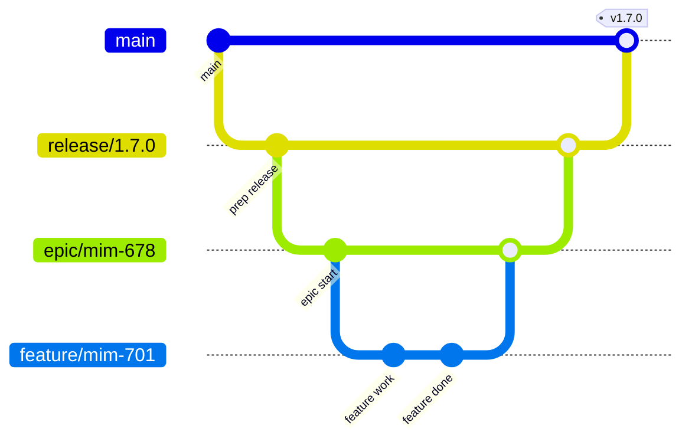

# Contribution Guidelines

## Code Formatting

The `onecore` repository contains a global .prettierrc and each sub-package
may contain an individual eslint configuration and/or inherit the global default.

Make sure that you have plugins installed and enabled in your editor before 
committing any code.

Source code that does not follow the prettier and eslint rules will not pass
the CI workflows.

## Branching and Development Flow

This repository follows a simple, predictable branching model:

### Main Branch
- **`main`** always represents the latest **production release**.
- It must stay **green**, **buildable**, and **deployable** at all times.
- Hotfixes may be branched from `main` and merged back after verification, 
  unless they are small and/or urgent enough to merit immediate fast-tracking to 
  production via main.
- Non-build related commits, e.g, documentation updates, may be pushed
  directly to main or via PR.

### Release Branches
- Example: `release/1.7.0`
- **`release/x.y.z`** branches represent work toward an upcoming release.
- Created from **main**
- Targets **main**
- Accepts PRs of completed, verified and accepted **epic/** and **feature/** branches 
  aimed at the release.
- Once testing is complete and the release is approved:
  - Tag the release (e.g. `v1.7.0`), then merge it to `main`.
  - Delete the branch

### Epic Branches
- Example: `epic/uth-227-publish-parking-spaces`
- **`epic/<project>-<issue#>-descriptive-slug`**
- Created from **main**, or - only when necessary - from other **epic/*** branches.
- Targets **release/***
- Used for ongoing work on **large, multi-feature initiatives**.
- Epics are integration branches where feature branches are merged via PRs.
- Avoid basing epic branches on other epic branches if possible - this is likely to
  lead to merge hell.
- Code reviews should have performed in smaller steps and via PRs before commits 
  touch the epic branch, as a meaningful review of a long-lived branch is near 
  impossible.

### Feature Branches
- Example: `feature/mim-348-add-credit-check`
- **`feature/<project>-<issue#>-descriptive-slug`**
- Created from either:
  - The corresponding `epic/...` branch (if part of a larger effort), or
  - `main` directly (for standalone work).
- Targets **epic/*** or **release/***
- Used for **individual features or fixes**.

### Hotfixes, chores and the will-not-be-easily-categorized Branches
- Example `hotfix/holy-moly-this-just-cannot-wait`
- Used for **hotfixes**, **documentation changes** and **non-build related** chores.
- Created from **main**
- Target **main**
- Use your judgement
  
The naming conventions of **main**, **release/*** and **epic/*** are required for the 
correct building and tagging of docker images for the individual applications and services.

Note that epic branches MUST follow the pattern of **`epic/<project>-<issue#>-descriptive-slug`**

### Typical Flow

### Summary

| Branch Type | Example                              | Purpose                    | Merges Into             |
|-------------|--------------------------------------|----------------------------|-------------------------|
| `feature/`  | `feature/mim-348-add-credit-check`   | Individual feature/fix     | `epic/…` or `release/…` |
| `epic/`     | `epic/uth-227-publish-parking-space` | Multi-feature initiative   | `release/…`             |
| `release/`  | `release/1.7.0`                      | Stabilization for release  | `main`                  |
| `main`      | —                                    | Current production release | —                       |

---
