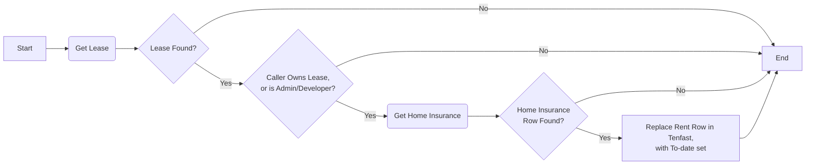
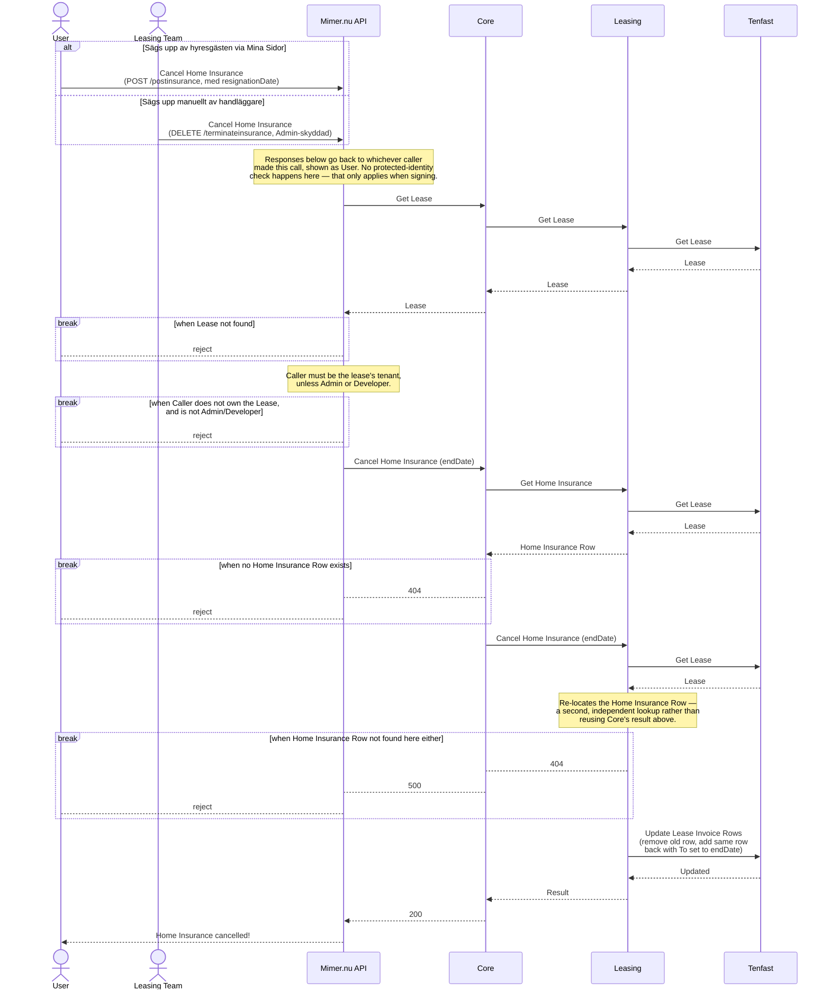

# Säg upp Hemförsäkring

_Del av [processöversikten](./DOCS_Overview.md) för hemförsäkring._

En hemförsäkring avslutas från ett visst datum — antingen av hyresgästen själv via Mina Sidor, eller manuellt av en handläggare via en Admin-skyddad endpoint i Mimer.nu API. Ingen anropare av den handläggarvägen hittades i de undersökta kodbaserna — den används sannolikt manuellt (t.ex. via Swagger) snarare än från ett byggt gränssnitt. Se [Teckna Hemförsäkring](./DOCS_Sign_Home_Insurance.md) för motsatta vägen.

## Flödesdiagram

Processens beslutslogik: vilka kontroller som styr om flödet går vidare till nästa steg, och vad som händer vid godkännande, nekande eller fel. System- och integrationsdetaljer är medvetet utelämnade här — se sekvensdiagrammet nedan för det.

## Sekvensdiagram

Vilka tjänster och externa system som anropas i varje steg, i vilken ordning, och var processen kan avbrytas vid en misslyckad kontroll. Täcker båda ingångarna (hyresgästens självbetjäning och det manuella Admin-anropet). Mimer.nu API behandlas som en extern aktör (se [processöversikten](./DOCS_Overview.md)) — bara dess relevanta affärsregler och anrop mot OneCore ritas ut.

