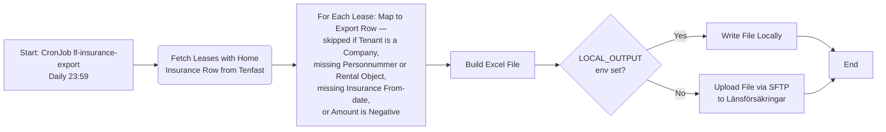
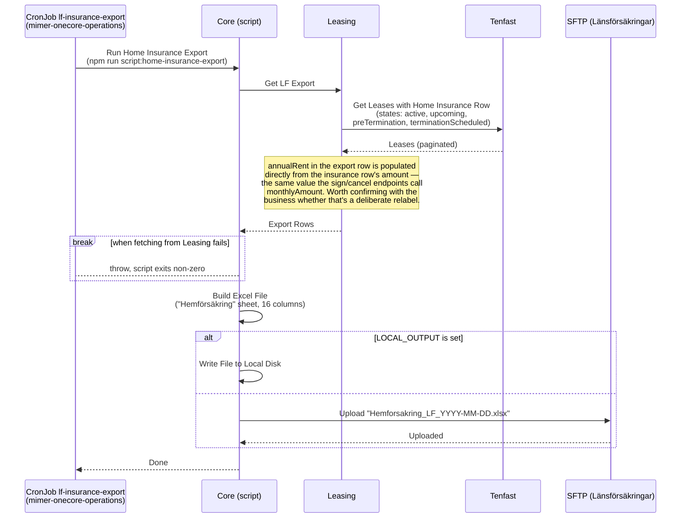

# Exportera Hemförsäkring till Länsförsäkringar

_Del av [processöversikten](./DOCS_Overview.md) för hemförsäkring._

Ett fristående script (`core/src/scripts/home-insurance-export.ts`) hämtar samtliga hyreskontrakt med en hemförsäkringsrad i Tenfast — i statusarna `active`, `upcoming`, `preTermination` och `terminationScheduled` — och skickar en daglig Excel-fil med dem till Länsförsäkringar via SFTP. Det här är ett annat exportflöde än mimer.nu:s eget (se [processöversiktens](./DOCS_Overview.md) avsnitt "Utanför denna dokumentation") — den här exporten läser från Tenfast, inte från mimer.nu:s lokala databas.

Schemaläggningen ligger inte i onecore-repot utan i `mimer-onecore-operations` (`apps/onecore/core/lfinsuranceexportcronjob.yaml`) — ett Kubernetes CronJob vid namn `lf-insurance-export` som kör `npm run script:home-insurance-export` i core-imagen, dagligen kl 23:59 (`59 23 * * *`).

## Flödesdiagram

Processens beslutslogik: vilka steg som körs, och vilka rader som filtreras bort vid mappning. System- och integrationsdetaljer är medvetet utelämnade här — se sekvensdiagrammet nedan för det.

## Sekvensdiagram

Vilka tjänster som anropas i varje steg, i vilken ordning. Detta är ett fristående script i core-paketet, inte en HTTP-endpoint — det körs utanför Koa-servern, som ett eget engångs-Kubernetes-Job skapat av CronJobbet, utan mänsklig initierare.

