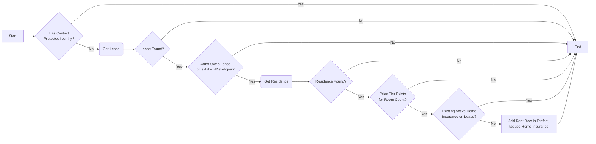
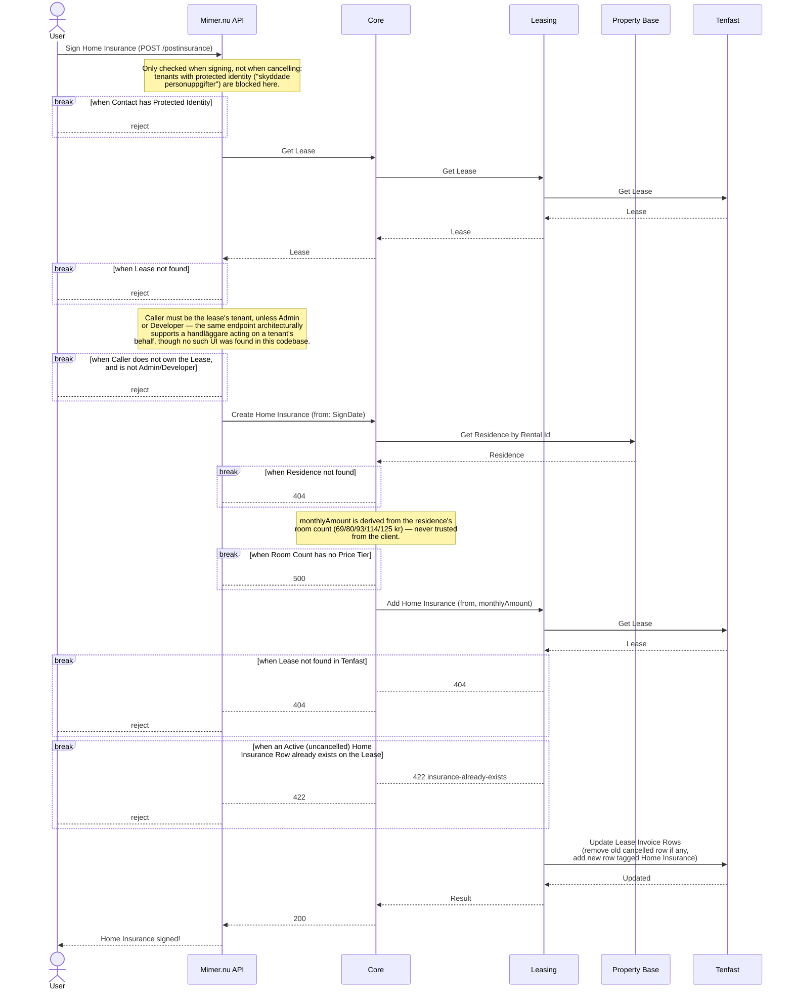

# Teckna Hemförsäkring

_Del av [processöversikten](./DOCS_Overview.md) för hemförsäkring._

En hyresgäst tecknar hemförsäkring för sin lägenhet via Mina Sidor. Mimer.nu API kontrollerar att hyresgästen äger kontraktet och inte har skyddade personuppgifter, varpå OneCore beräknar priset utifrån lägenhetens rumsantal och lägger till en hyresrad i Tenfast, taggad som hemförsäkring. Se [Säg upp Hemförsäkring](./DOCS_Cancel_Home_Insurance.md) för motsatta vägen.

## Flödesdiagram

Processens beslutslogik: vilka kontroller som styr om flödet går vidare till nästa steg, och vad som händer vid godkännande, nekande eller fel. System- och integrationsdetaljer är medvetet utelämnade här — se sekvensdiagrammet nedan för det.

## Sekvensdiagram

Vilka tjänster och externa system som anropas i varje steg, i vilken ordning, och var processen kan avbrytas vid en misslyckad kontroll. Mimer.nu API behandlas som en extern aktör (se [processöversikten](./DOCS_Overview.md)) — bara dess relevanta affärsregler och anrop mot OneCore ritas ut.

