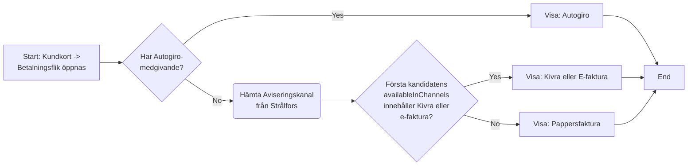
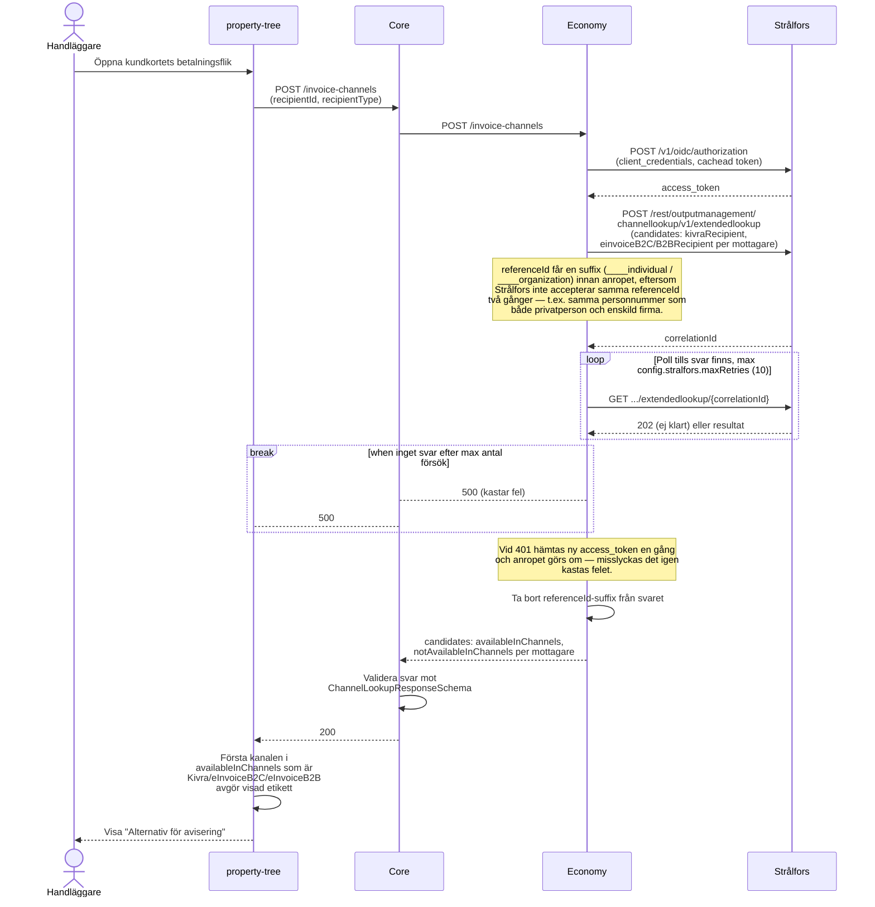

# Hämta Aviseringskanal (Strålfors Channel Lookup)

_Del av [processöversikten](./DOCS_Overview.md) för fakturadistribution._

När en handläggare öppnar en hyresgästs betalningsflik i property-tree hämtas "Alternativ för avisering" — en uppgift om hyresgästen kan nås digitalt (Kivra eller e-faktura) eller om det blir pappersfaktura. Uppgiften kommer från Strålfors, som är Mimers leverantör för fakturadistribution och känner till vilka digitala kanaler en mottagare faktiskt är ansluten till. Autogiro kollas separat och går alltid först i UI:t om det finns, oavsett vad kanalslagningen svarar.

## Flödesdiagram

Vilket värde som visas för "Alternativ för avisering", i property-tree UI:t. System- och integrationsdetaljer är medvetet utelämnade här — se sekvensdiagrammet nedan för det.

## Sekvensdiagram

Vilka tjänster och externa system som anropas i varje steg, i vilken ordning.

## Att känna till

- Vilken kanal som visas när flera är tillgängliga styrs av **ordningen Strålfors returnerar dem i**, inte av en prioritering i OneCores kod — `property-tree` väljer bara den första posten i `availableInChannels` som matchar en känd etikett (`eInvoiceB2C`/`eInvoiceB2B` → "E-faktura", `Kivra` → "Kivra").
- Det här är ett rent uppslag — det skickar ingen faktura och påverkar inte vilken kanal Strålfors faktiskt använder när en fil väl skickas (se [Överför Filer till Strålfors](./DOCS_Transfer_Files_to_Stralfors.md)).
- `recipientId` skickas in som personnummer/organisationsnummer från UI:t; Economy strippar bort allt utom siffror innan det skickas vidare till Strålfors.
