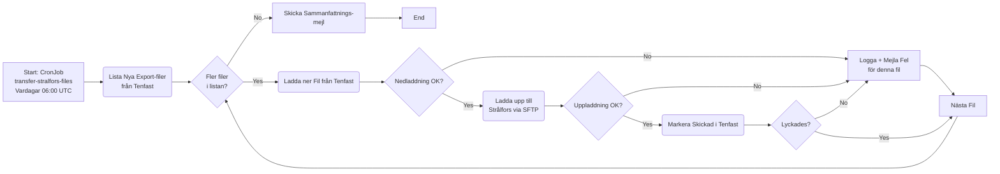
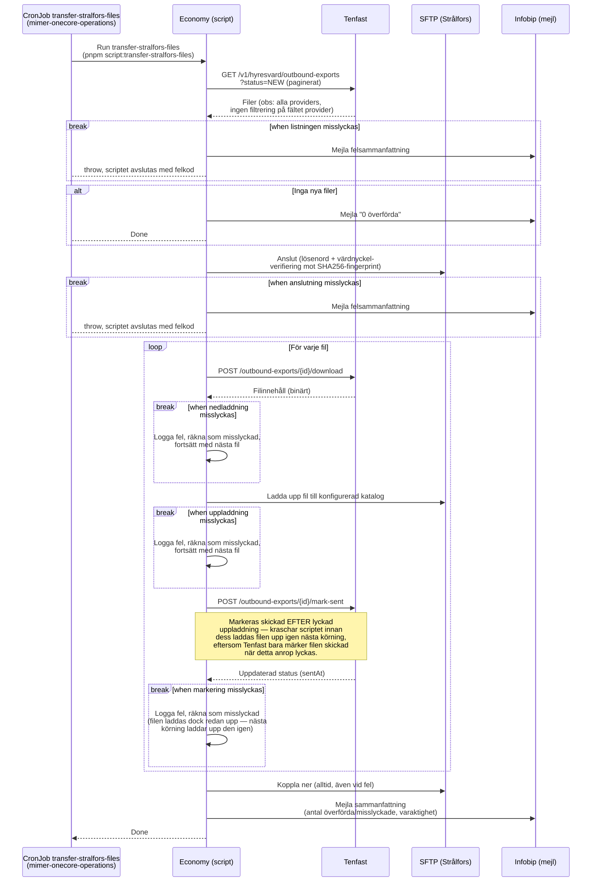

# Överför Filer till Strålfors

_Del av [processöversikten](./DOCS_Overview.md) för fakturadistribution._

Ett fristående script (`services/economy/src/scripts/transfer-stralfors-files.ts`) hämtar samtliga nya fakturafiler som Tenfast har kö:at för export (`status: NEW` i Tenfasts `outbound-exports`), laddar upp dem till Strålfors via SFTP för tryck och distribution, och markerar dem som skickade i Tenfast. Till skillnad från övriga processer i den här mappen körs det här scriptet helt inom **Economy** — Core är inte inblandat (se [processöversiktens](./DOCS_Overview.md) not om det).

Schemaläggningen ligger inte i onecore-repot utan i `mimer-onecore-operations` (`apps/onecore/economy/transferstralforsfilescronjob.yaml`) — ett Kubernetes CronJob vid namn `transfer-stralfors-files` som kör `pnpm script:transfer-stralfors-files` i economy-imagen, vardagar kl 06:00 UTC (`0 6 * * 1-5`, "måste bli klar innan Strålfors 09:00-deadline" enligt kommentar i manifestet). **CronJobbet är för närvarande satt till `suspend: true`** — bekräfta med teamet om det är avsiktligt innan detta tas som sanning om produktionsbeteende.

## Flödesdiagram

Processens beslutslogik: vilka steg som körs, och hur fel per fil hanteras. System- och integrationsdetaljer är medvetet utelämnade här — se sekvensdiagrammet nedan för det.

## Sekvensdiagram

Vilka tjänster som anropas i varje steg, i vilken ordning. Det här är ett fristående script, inte en HTTP-endpoint — det körs som ett eget engångs-Kubernetes-Job skapat av CronJobbet, utan mänsklig initierare.

## Att känna till

- **Ingen filtrering på `provider`.** Scriptet litar på att Tenfasts `NEW`-kö bara innehåller filer avsedda för Strålfors — det läser inte fältet `provider`/`type` på exportposten. Om Tenfast någon gång börjar kö:a andra exporttyper i samma kö skulle de tystas laddas upp till Strålfors SFTP utan att scriptet upptäcker det.
- **Per-fil-isolering.** Ett fel på en fil (nedladdning, uppladdning eller markering) stoppar inte resten av batchen — det loggas, mejlas och scriptet fortsätter med nästa fil.
- **SFTP-värdverifiering är valfri men rekommenderad.** Om `STRALFORS_EXPORT__SFTP__HOST_FINGERPRINT` inte är satt loggas en varning och all värdverifiering hoppas över (`hostVerifier` returnerar alltid `true`).
- **Filformat:** enligt testfabriken (`TenfastOutboundExportFactory`) är exempeldata `type: 'stralfors_invoice'`, `format: 'xml'` — dvs XML-filer med fakturadata från Tenfast.
