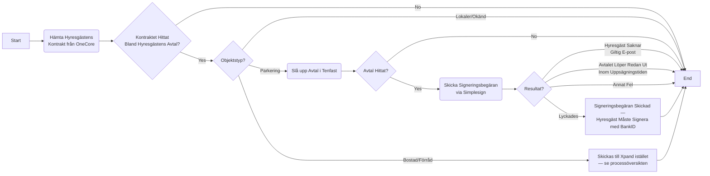
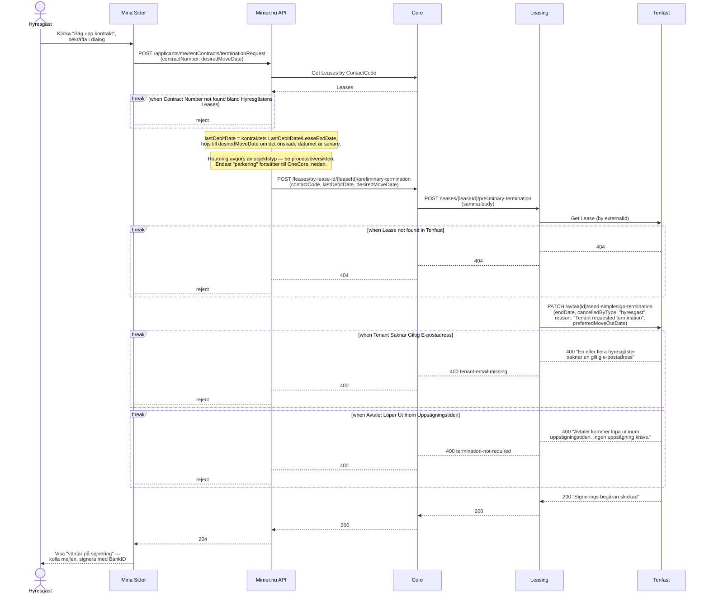

# Hyresgäst Begär Uppsägning av Bilplats (Preliminär Uppsägning)

_Del av [processöversikten](./DOCS_Overview.md) för uppsägning av avtal._

En hyresgäst säger upp sin bilplats via Mina Sidor. Mimer.nu API slår upp hyresgästens kontrakt hos OneCore, avgör att objektstypen är `parkering` och skickar begäran vidare till OneCore, som via Leasing ber Tenfast skicka en signeringsbegäran (BankID) till hyresgästen. Uppsägningen är först slutgiltig när hyresgästen signerar — det här flödet dokumenterar bara själva begäran. Se [processöversikten](./DOCS_Overview.md) för hur bostad/förråd hanteras istället (går direkt till Xpand, aldrig via onecore).

## Flödesdiagram

Processens beslutslogik: vilka kontroller som styr om flödet går vidare, och vad som händer vid fel. System- och integrationsdetaljer är medvetet utelämnade här — se sekvensdiagrammet nedan för det.

## Sekvensdiagram

Vilka tjänster och externa system som anropas i varje steg, i vilken ordning, och var processen kan avbrytas vid en misslyckad kontroll. Mimer.nu API behandlas som en extern aktör (se [processöversikten](./DOCS_Overview.md)) — bara dess relevanta affärsregler och anrop mot OneCore ritas ut.

## Att känna till

- Det här är den **enda** platsen i onecore där en bilplats-uppsägning är hyresgäst-initierad — motsatsen till [Synka Uppsägning från Xpand](./DOCS_Terminate_Lease_via_Xpand_Sync.md), där bilplatser tvärtom filtreras bort (se processöversiktens not om det).
- `cancelledByType: 'hyresgast'` är hårdkodat av onecore i anropet till Tenfast — det är så Tenfast (och därmed statistik/revisionsspår) vet att uppsägningen kom från hyresgästen själv.
- Det här steget skickar bara en **signeringsbegäran** — avtalet är inte uppsagt förrän hyresgästen faktiskt signerar med BankID. Själva stegövergången i Tenfast (från `preTermination` till `terminationScheduled`) styrs av Tenfast internt och är inte synlig i den här kodbasen.
- **Tenfast bekräftar uppsägningen tillbaka till OneCore (AVTAL-232).** När Tenfast internt slutfört uppsägningen anropar Tenfast `POST /v1/tenant-notifications/lease-termination-confirmation` på Core (med en `Idempotency-Key`-header för säkra omförsök), och Core skickar då ett bekräftelsemejl till hyresgästen via Communication/Infobip. Bara `rentalType: "Bilplats"` stöds idag. Det här är den enda platsen i hela uppsägningsflödet där Tenfast anropar **in** i onecore istället för tvärtom.
- Mina Sidor sätter ett standardvärde för `desiredMoveDate` om hyresgästen inte anger ett eget: sista dagen i månaden, 3 månader fram — en UI-standard, inte en regel som verifieras på serversidan.
