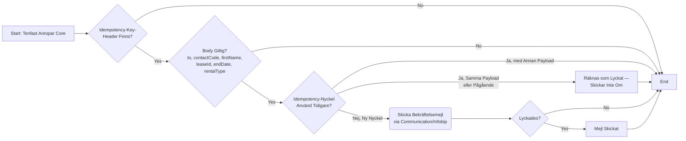

# Tenfast Bekräftar Uppsägning av Bilplats (Bekräftelsemejl)

_Del av [processöversikten](./DOCS_Overview.md) för uppsägning av avtal._

När Tenfast internt slutför en bilplats-uppsägning (övergången från `preTermination` till `terminationScheduled` efter att hyresgästen signerat via BankID, se [Hyresgäst Begär Uppsägning av Bilplats](./DOCS_Preliminary_Terminate_Lease.md)) anropar Tenfast ett publikt Core-API för att be OneCore skicka ett bekräftelsemejl till hyresgästen. OneCore äger själva utskicket och kommunikationsloggen — Tenfast skickar bara strukturerade fakta, inget färdigt mejlinnehåll.

## Flödesdiagram

Processens beslutslogik: vilka kontroller som styr om mejlet skickas. System- och integrationsdetaljer är medvetet utelämnade här — se sekvensdiagrammet nedan för det.



## Sekvensdiagram

Vilka tjänster som anropas i varje steg, i vilken ordning, och var processen kan avbrytas vid en misslyckad kontroll.

```mermaid
sequenceDiagram
    participant Tenfast as Tenfast
    participant Core as Core
    participant Communication as Communication
    participant Infobip as Infobip
    actor Tenant as Hyresgäst

    Tenfast ->> Core: POST /v1/tenant-notifications/<br/>lease-termination-confirmation<br/>(header Idempotency-Key; autentiserad via<br/>Keycloak-roll tenant-notifications:lease-termination<br/>eller api-access)

    break when Idempotency-Key-Header Saknas
        Core-->Tenfast: 400
    end

    break when Body Inte Matchar Schema<br/>(rentalType stöder idag bara "Bilplats")
        Core-->Tenfast: 400
    end

    Core ->> Core: Slå upp Idempotency-Nyckel<br/>mot in-memory-store (TTL)

    break when Nyckel Använd Tidigare med Annan Payload
        Core-->Tenfast: 409 idempotency-conflict
    end

    alt Nyckel Redan Lyckad eller Pågående (Samma Payload)
        Core-->>Tenfast: 200 (skickar inte om)
    else Ny Nyckel — Reservation Görs
        Core ->> Communication: POST /sendLeaseTerminationConfirmation
        Communication ->> Infobip: Skicka mejl<br/>(mall LeaseTerminationConfirmationTemplateId)
        Infobip -->> Tenant: Bekräftelsemejl

        alt Lyckades
            Communication-->>Core: 204
            Core ->> Core: Markera Nyckel som Lyckad
            Core-->>Tenfast: 200
        else Misslyckades
            Communication-->>Core: Fel
            Core ->> Core: Släpp Reservationen<br/>(Tenfast kan försöka igen<br/>med samma nyckel)
            Core-->>Tenfast: 502 send-failed
        end
    end

```

## Att känna till

- **Bara bilplatser stöds idag.** `rentalType` är ett enum med bara värdet `"Bilplats"` — koden är kommenterad "Extend when housing is added", så bostad är en känd, medveten framtida utökning, inte ett glapp.
- **Idempotency-nyckeln lagras in-memory per Core-instans**, med TTL — inte i en delad databas. Koden har en egen kommentar om att byta ut det mot delad lagring "when Core runs multi-instance". Om Core körs med flera instanser bakom en load balancer kan Tenfasts idempotenta retry alltså träffa en annan instans som inte känner igen nyckeln, och skicka mejlet igen.
- **I icke-produktionsmiljöer skrivs `to` alltid över** med en konfigurerad testadress (`config.emailAddresses.tenantDefault`), oavsett vad Tenfast skickar in — bra att veta vid felsökning i test.
- **Det här täcker bara bekräftelsemejlet, inte själva stegövergången i Tenfast.** Tenfasts interna hantering av signeringen (från `preTermination` till `terminationScheduled`) är fortfarande inte synlig i den här kodbasen — bara det faktum att Tenfast, någon gång efter det, väljer att anropa det här API:t.
