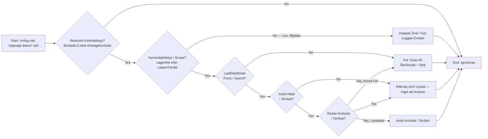
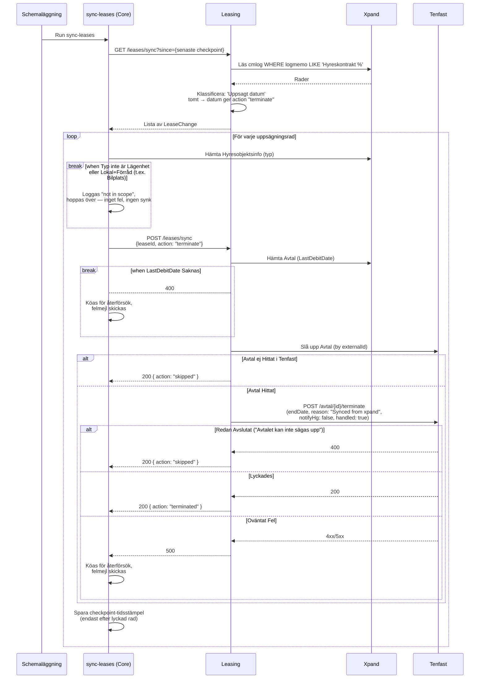

# Synka Uppsägning från Xpand

_Del av [processöversikten](./DOCS_Overview.md) för uppsägning av avtal._

Ett schemalagt script i Core (`core/src/scripts/sync-leases`) pollar Xpands `cmlog`-tabell efter avtal där fältet "Uppsagt datum" precis satts — det vill säga en slutgiltig, bekräftad uppsägning i Xpand (till skillnad från en preliminär uppsägning, som ignoreras helt av den här synken). För varje sådan rad kontrolleras att hyresobjektet är av en typ som ska synkas, varpå avtalet avslutas i Tenfast via Leasing.

## Flödesdiagram

Processens beslutslogik: vilka kontroller som styr om en rad synkas, hoppas över eller köas för återförsök. System- och integrationsdetaljer är medvetet utelämnade här — se sekvensdiagrammet nedan för det.

## Sekvensdiagram

Vilka tjänster som anropas i varje steg, i vilken ordning. Det här är ett fristående, schemalagt script — inte en HTTP-endpoint initierad av en människa.

## Att känna till

- **Bilplatser (Garagekontrakt) synkas aldrig här.** `cmlog`-adaptern klassificerar Garagekontrakt-rader precis som Bostads-/Lokalkontrakt, men filtret `isResidenceOrStorage` i `sync-leases` släpper bara igenom lägenhet eller lokal+förråd. En bilplats som sägs upp direkt i Xpand loggas som "not in scope" och synkas aldrig till Tenfast via det här flödet.
- **Idempotent.** Om avtalet redan är avslutat i Tenfast (Tenfast svarar med felmeddelandet "Avtalet kan inte sägas upp") räknas raden ändå som lyckad — bra för omkörningar, men jämför med [Synka Makulering](./DOCS_Void_Lease_via_Xpand_Sync.md), som saknar motsvarande skydd.
- **Checkpoint sparas per rad, efter lyckad synk.** Kraschar scriptet mitt i en körning synkas redan behandlade rader inte om, medan resterande rader (och den trasiga) fångas upp nästa körning eller ligger kvar i återförsökskön.
- En preliminär xpand-uppsägning (fältet "Preliminärt uppsagt") triggar **inte** det här flödet — bara när "Uppsagt datum" faktiskt sätts.
