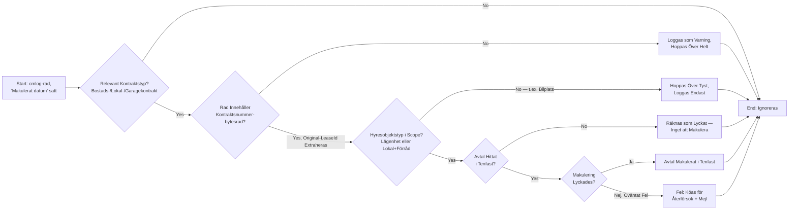
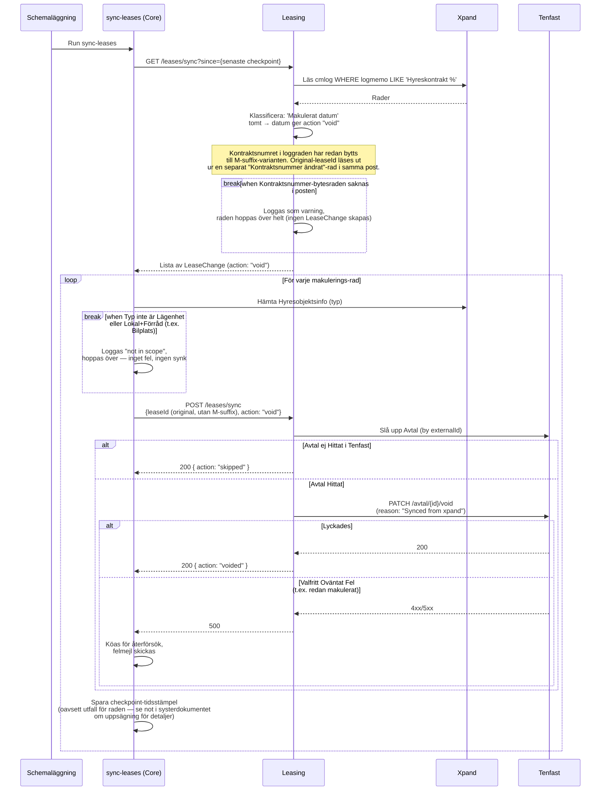

# Synka Makulering från Xpand

_Del av [processöversikten](./DOCS_Overview.md) för uppsägning av avtal._

Samma schemalagda script som synkar uppsägningar (`core/src/scripts/sync-leases`) pollar också Xpands `cmlog`-tabell efter avtal där fältet "Makulerat datum" precis satts — det vill säga att kontraktet annullerats, inte bara sagts upp. Makulering byter kontraktsnummer i Xpand (t.ex. `.../10` → `.../10M`), så synken måste läsa ut det ursprungliga kontraktsnumret ur samma logg-post för att hitta rätt avtal i Tenfast.

## Flödesdiagram

Processens beslutslogik: vilka kontroller som styr om en rad synkas, hoppas över eller köas för återförsök. System- och integrationsdetaljer är medvetet utelämnade här — se sekvensdiagrammet nedan för det.

## Sekvensdiagram

Vilka tjänster som anropas i varje steg, i vilken ordning. Det här är ett fristående, schemalagt script — inte en HTTP-endpoint initierad av en människa.

## Att känna till

- **Ingen idempotens-guard, till skillnad från uppsägning.** `voidLease` har ingen specialhantering av något "redan makulerat"-felmeddelande motsvarande terminate-flödets `'Avtalet kan inte sägas upp'` — varje oväntat 4xx-svar räknas som ett hårt fel. En rad som redan är makulerad i Tenfast (t.ex. efter en tidigare delvis lyckad körning) kan därför fastna i återförsökskön permanent, eftersom varje ny körning ger samma fel tills någon manuellt tar bort den ur kön.
- **Kontraktsnummer-bytesraden är ett hårt krav.** Saknas "Kontraktsnummer ändrat"-raden i samma cmlog-post kan original-leaseId inte extraheras, och hela raden hoppas över med bara en varningslogg — ingen synk sker alls, trots att "Makulerat datum" faktiskt sattes i Xpand.
- **Samma bilplats-filtrering som uppsägningsflödet.** Se [processöversiktens](./DOCS_Overview.md) not — `isResidenceOrStorage` filtrerar bort Garagekontrakt precis som för terminate.
