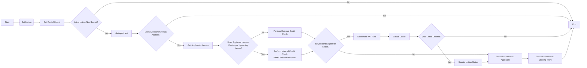
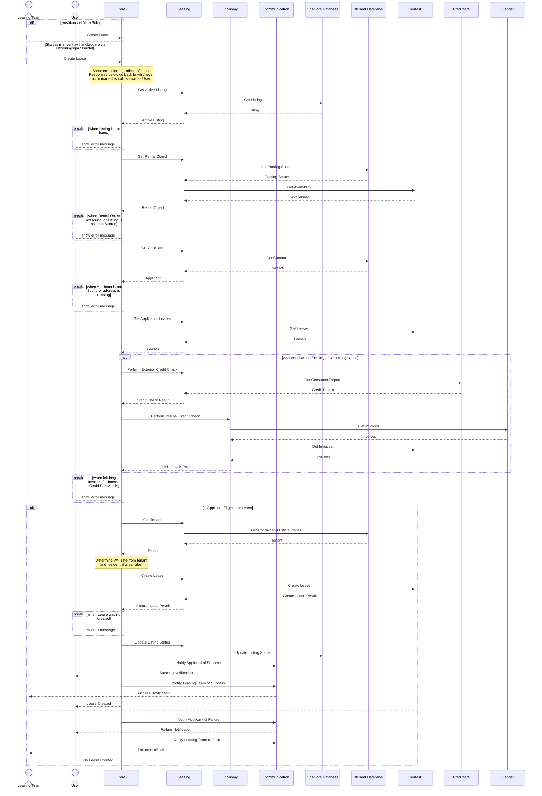

# Skapa Kontrakt för Icke-poängsatt Bilplats

En sökande ansöker om en icke-poängsatt bilplats (först till kvarn), antingen direkt via Mina Sidor eller å sökandens vägnar av en handläggare via Uthyrningsgränssnittet. Processen validerar annons och sökande, gör en automatisk kreditkontroll (extern via Creditsafe, eller intern via betalningshistorik om sökanden redan har ett kontrakt) och skapar kontraktet i Tenfast vid godkännande. Sökanden och uthyrningsteamet notifieras om utfallet oavsett utgång.

## Flödesdiagram

Processens beslutslogik: vilka kontroller som styr om flödet går vidare till nästa steg, och vad som händer vid godkännande, nekande eller fel. System- och integrationsdetaljer är medvetet utelämnade här — se sekvensdiagrammet nedan för det.

## Sekvensdiagram

Vilka tjänster och externa system som anropas i varje steg, i vilken ordning, och var processen kan avbrytas vid en misslyckad kontroll. Täcker båda ingångarna (sökandens självbetjäning och handläggarinitierat via Uthyrningsgränssnittet), och visar att backend-tjänsterna Leasing och Economy samt de externa systemen XPand, Tenfast, Creditsafe och Xledger alla är inblandade beroende på vilken väg som tas.

