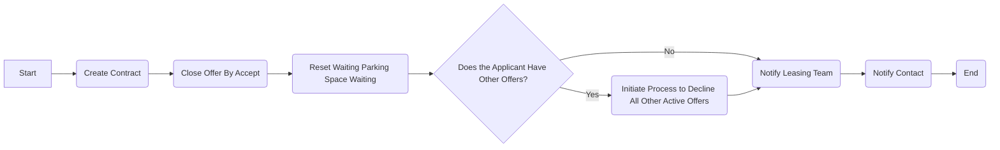
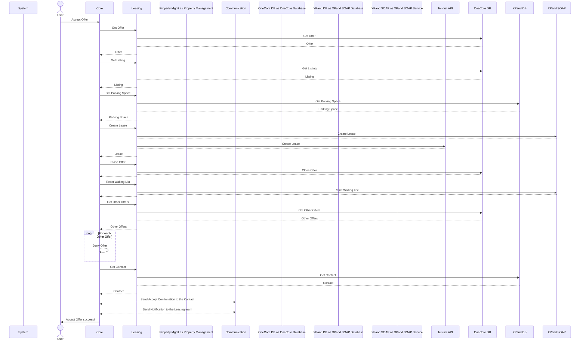

# Accept Offer for Scored Parking Space

## Flowchart

```mermaid
flowchart LR
A[Start] --> E(Create Contract)
E --> F(Close Offer By Accept)
F --> H(Reset Waiting Parking Space Waiting)
H --> G{Does the Applicant Have Other Offers?}

G --> |Yes| I(Initiate Process to Decline All Other Active Offers)
G --> |No| J(Notify Leasing Team)
I --> J
J --> K(Notify Contact)
K --> O(End)

```

## Sequence Diagram

In progress

```mermaid
sequenceDiagram
    participant System as System
    actor User as User
    participant Core as Core
    participant Leasing as Leasing
    participant Property Mgmt as Property Management
    participant Communication as Communication
    participant OneCore DB as OneCore Database
    participant XPand DB as XPand SOAP Database
    participant XPand SOAP as XPand SOAP Service
    participant Tenfast API

    User ->> Core: Accept Offer
    Core ->>Leasing: Get Offer
        Leasing ->>OneCore DB: Get Offer
        OneCore DB --> Leasing: Offer
        Leasing -->> Core: Offer

    Core ->>Leasing: Get Listing
        Leasing ->>OneCore DB: Get Listing
        OneCore DB --> Leasing: Listing
        Leasing -->> Core: Listing

    Core ->>Leasing: Get Parking Space
        Leasing ->>XPand DB: Get Parking Space
        XPand DB --> Leasing: Parking Space
        Leasing -->> Core: Parking Space

    Core ->>Leasing: Create Lease
        Leasing ->>XPand SOAP: Create Lease
        XPand SOAP --> Leasing:
        Leasing ->>Tenfast API: Create Lease
        Tenfast API --> Leasing:
        Leasing -->> Core: Lease

    Core ->>Leasing: Close Offer
        Leasing ->>OneCore DB: Close Offer
        OneCore DB --> Leasing:
        Leasing -->> Core:

    Core ->>Leasing: Reset Waiting List
        Leasing ->>XPand SOAP: Reset Waiting List
        XPand SOAP --> Leasing:
        Leasing -->> Core:

    Core ->>Leasing: Get Other Offers
        Leasing ->>OneCore DB: Get Other Offers
        OneCore DB --> Leasing: Other Offers
        Leasing -->> Core: Other Offers

    loop For each Other Offer
        Core ->>Core: Deny Offer
    end

    Core ->>Leasing: Get Contact
        Leasing ->>XPand DB: Get Contact
        XPand DB --> Leasing: Contact
        Leasing -->> Core: Contact

    Core ->>Communication: Send Accept Confirmation to the Contact
        Communication -->> Core:

    Core ->>Communication: Send Notification to the Leasing team
        Communication -->> Core:


    Core ->> User: Accept Offer success!

```
