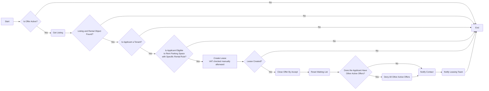
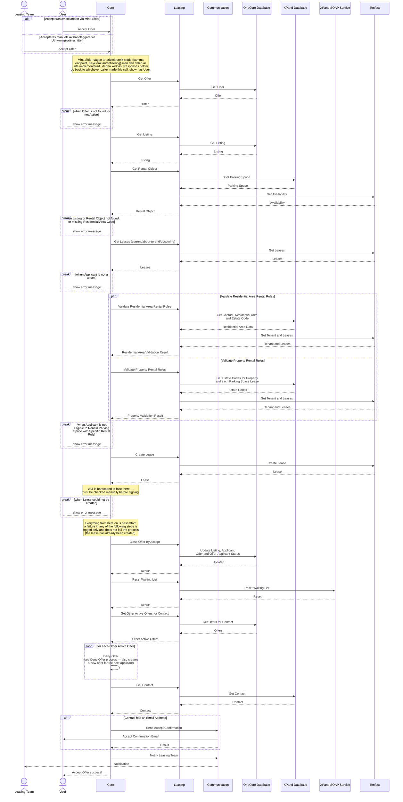

# Acceptera Erbjudande för Poängsatt Bilplats

_Del av [processöversikten](./DOCS_Overview.md) för poängsatta bilplatser._

En sökande accepterar ett erbjudande om en poängsatt bilplats, skapat av [Create Offer](./DOCS_Create_Offer_for_Scored_Parking_Space.md)-processen — antingen själv via Mina Sidor eller å sökandens vägnar av en handläggare via Uthyrningsgränssnittet. Processen kontrollerar att erbjudandet är aktivt, att sökanden fortfarande är hyresgäst och uppfyller områdes- och fastighetsspecifika uthyrningsregler, och skapar därefter kontraktet. Eventuella andra aktiva erbjudanden till samma sökande [nekas](./DOCS_Deny_Offer.md) automatiskt — vilket i sin tur skapar ett nytt erbjudande till nästa sökande på de annonserna.

## Flödesdiagram

Processens beslutslogik: vilka kontroller som styr om flödet går vidare till nästa steg, och vad som händer vid godkännande, nekande eller fel. System- och integrationsdetaljer är medvetet utelämnade här — se sekvensdiagrammet nedan för det.

## Sekvensdiagram

Vilka tjänster och externa system som anropas i varje steg, i vilken ordning, och var processen kan avbrytas vid en misslyckad kontroll. Täcker båda ingångarna (sökandens självbetjäning och handläggarinitierat via Uthyrningsgränssnittet), och visar att mikrotjänsten Leasing samt de externa systemen XPand och Tenfast är inblandade.

