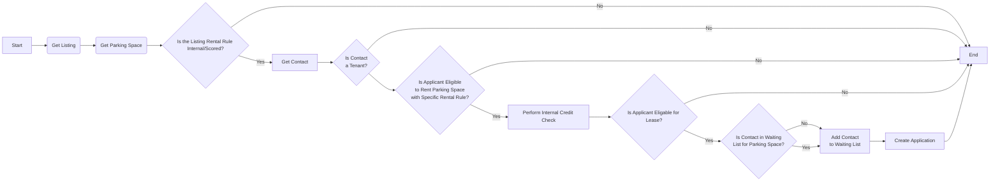
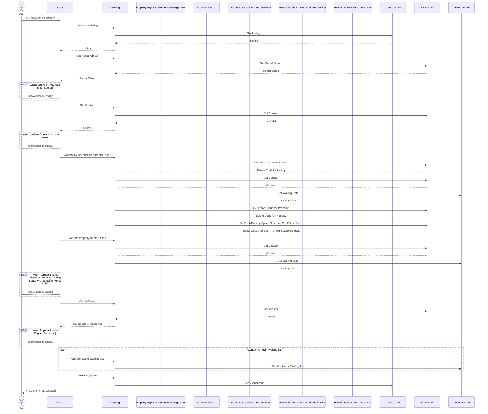

# Create Note of Interest for Scored Parking Space

## Flowchart

```mermaid
flowchart LR
A[Start] -->B(Get Listing)
B --> R(Get Parking Space)
R --> C{Is the Listing Rental Rule Internal/Scored?}
C --> |No| O
C --> |Yes| D[Get Contact]
D --> E{Is Contact<br/>a Tenant?}
E --> |No| O[End]
E --> F{Is Applicant Eligible <br/>to Rent Parking Space <br/>with Specific Rental Rule?}
F --> |No| O
F --> |Yes| P[Perform Internal Credit Check]
P --> Q{Is Applicant Eligable for Lease?}
Q --> |No| O
Q --> |Yes| H{Is Contact in Waiting<br/>List for Parking Space?}
H --> |No| I[Add Contact<br/>to Waiting List]
I --> K[Create Application]
H --> |Yes| I
K --> O
```

## Sequence Diagram

```mermaid
sequenceDiagram
    #participant System as System
    actor User as User
    participant Core as Core
    participant Leasing as Leasing
    participant Property Mgmt as Property Management
    participant Communication as Communication
    participant OneCore DB as OneCore Database
    participant XPand SOAP as XPand SOAP Service
    participant XPand DB as XPand Database

    User ->> Core: Create Note Of Interest

    Core ->> Leasing: Get Active Listing
    Leasing ->> OneCore DB: Get Listing
    OneCore DB -->> Leasing: Listing
    Leasing -->> Core: Listing
    Core ->> Leasing: Get Rental Object
    Leasing ->> XPand DB: Get Rental Object
    XPand DB -->> Leasing:Rental Object
    Leasing -->> Core: Rental Object
    break when Listing Rental Rule is not Scored
        Core-->User: show error message
    end

    Core ->> Leasing: Get Contact
    Leasing ->> XPand DB: Get Contact
    XPand DB -->> Leasing:Contact
    Leasing -->> Core: Contact
    break when Contact is not a tenant
        Core-->User: show error message
    end

    Core ->> Leasing: Validate Residential Area Rental Rules
    Leasing ->> XPand DB:Get Estate Code for Listing
    XPand DB --> Leasing: Estate Code for Listing
    Leasing ->> XPand DB:Get Contact
    XPand DB --> Leasing: Contact
    Leasing ->> XPand SOAP:Get Waiting Lists
    XPand SOAP --> Leasing: Waiting Lists
    Leasing ->> XPand DB:Get Estate Code for Property
    XPand DB --> Leasing: Estate Code for Property
    Leasing ->> XPand DB:For Each Parking Space Contract, Get Estate Code
    XPand DB --> Leasing: Estate Codes for Each Parking Space Contract

    Core ->> Leasing: Validate Property Rental Rules
    Leasing ->> XPand DB:Get Contact
    XPand DB --> Leasing: Contact
    Leasing ->> XPand SOAP:Get Waiting Lists
    XPand SOAP --> Leasing: Waiting Lists

    break when Applicant is not Eligible to Rent in Parking Space with Specific Rental Rule
        Core-->User: show error message
    end

    Core ->> Leasing: Credit Check
    Leasing ->> XPand DB: Get Leases
    XPand DB -->> Leasing: Leases
    Leasing -->> Core: Credit Check Response

    break when Applicant is not Eligible for Lease
        Core-->User: show error message
    end
    alt Contact is not in Waiting List
        Core ->> Leasing: Add Contact to Waiting List
        Leasing ->> XPand SOAP: Add Contact to Waiting List
    end

    Core ->> Leasing: Create Applicant
    Leasing ->> OneCore DB: Create Applicant

    Core ->> User: Note of Interest Created


```
