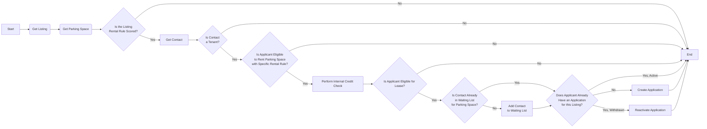

# Skapa Intresseanmälan för Poängsatt Bilplats

_Del av [processöversikten](./DOCS_Overview.md) för poängsatta bilplatser._

En hyresgäst anmäler intresse för en poängsatt bilplats (kösystem), antingen direkt via Mina Sidor eller å sökandens vägnar av en handläggare via Uthyrningsgränssnittet. Processen kräver att sökanden redan är hyresgäst, validerar områdes- och fastighetsspecifika uthyrningsregler, gör en intern kreditkontroll baserad på betalningshistorik, och placerar sökanden i bilplatskön. En befintlig, tidigare återkallad ansökan återaktiveras istället för att skapa en ny. Sökanden blir därmed aktuell när [Create Offer](./DOCS_Create_Offer_for_Scored_Parking_Space.md)-processen skapar erbjudanden för annonser vars visningsperiod gått ut.

## Flödesdiagram

Processens beslutslogik: vilka kontroller som styr om flödet går vidare till nästa steg, och vad som händer vid godkännande, nekande eller fel. System- och integrationsdetaljer är medvetet utelämnade här — se sekvensdiagrammet nedan för det.

## Sekvensdiagram

Vilka tjänster och externa system som anropas i varje steg, i vilken ordning, och var processen kan avbrytas vid en misslyckad kontroll. Täcker båda ingångarna (sökandens självbetjäning och handläggarinitierat via Uthyrningsgränssnittet), och visar att mikrotjänsterna Leasing och Economy samt de externa systemen XPand, Tenfast och Xledger alla är inblandade beroende på vilken väg som tas.

```mermaid
sequenceDiagram
    actor LeasingTeam as Leasing Team
    actor User as User
    participant Core as Core
    participant Leasing as Leasing
    participant Economy as Economy
    participant Communication as Communication
    participant OneCoreDB as OneCore Database
    participant XPandDB as XPand Database
    participant XPandSOAP as XPand SOAP Service
    participant Tenfast as Tenfast
    participant Xledger as Xledger

    alt Ansökan via Mina Sidor
        User ->> Core: Create Note Of Interest
    else Skapas manuellt av handläggare via Uthyrningsgränssnittet
        LeasingTeam ->> Core: Create Note Of Interest
    end
    note over Core: Same endpoint regardless of caller.<br/>Responses below go back to whichever<br/>actor made this call, shown as User.

    Core ->> Leasing: Get Active Listing
    Leasing ->> OneCoreDB: Get Listing
    OneCoreDB -->> Leasing: Listing
    Leasing -->> Core: Active Listing

    break when Listing is not found
        Core-->User: show error message
    end

    Core ->> Leasing: Get Rental Object
    Leasing ->> XPandDB: Get Parking Space
    XPandDB -->> Leasing: Parking Space
    Leasing ->> Tenfast: Get Availability
    Tenfast -->> Leasing: Availability
    Leasing -->> Core: Rental Object

    break when Rental Object not found, or Listing Rental Rule is not Scored
        Core-->User: show error message
    end

    Core ->> Leasing: Get Contact
    Leasing ->> XPandDB: Get Contact
    XPandDB -->> Leasing: Contact
    Leasing -->> Core: Contact

    break when Applicant is not found
        Core-->User: show error message
    end

    Core ->> Leasing: Get Leases (current/upcoming)
    Leasing ->> Tenfast: Get Leases
    Tenfast -->> Leasing: Leases
    Leasing -->> Core: Leases

    break when Contact is not a tenant
        Core-->User: show error message
    end

    par Validate Residential Area Rental Rules
        Core ->> Leasing: Validate Residential Area Rental Rules
        alt Area has no Specific Rental Rules
            note over Leasing: Early exit — checked against a<br/>hardcoded list of area codes, no<br/>XPandDB or Tenfast calls made.
            Leasing -->> Core: No Rules Apply
        else Area has Specific Rental Rules
            Leasing ->> XPandDB: Get Contact, Residential Area<br/>and Estate Code
            XPandDB -->> Leasing: Residential Area Data
            Leasing ->> Tenfast: Get Tenant and Leases
            Tenfast -->> Leasing: Tenant and Leases
            Leasing -->> Core: Residential Area Validation Result
        end
    and Validate Property Rental Rules
        Core ->> Leasing: Validate Property Rental Rules
        Leasing ->> XPandDB: Get Estate Codes for Property<br/>and each Parking Space Lease
        XPandDB -->> Leasing: Estate Codes
        alt Property has no Specific Rental Rules
            Leasing -->> Core: No Rules Apply<br/>(no Tenfast call made)
        else Property has Specific Rental Rules
            Leasing ->> Tenfast: Get Tenant and Leases
            Tenfast -->> Leasing: Tenant and Leases
            Leasing -->> Core: Property Validation Result
        end
    end

    break when Applicant is not Eligible to Rent in Parking Space with Specific Rental Rule
        Core-->User: show error message
    end

    Core ->> Economy: Get Invoices (last 6 months)
    Economy ->> Xledger: Get Invoices
    Xledger -->> Economy: Invoices
    Economy ->> Tenfast: Get Invoices
    Tenfast -->> Economy: Invoices
    Economy -->> Core: Invoices

    break when fetching Invoices for Internal Credit Check fails
        Core-->User: show error message
    end

    Core ->> Core: Filter to Invoices sent to Debt<br/>Collection — pass if none found

    break when Applicant is not Eligible for Lease
        Core ->> Communication: Notify Leasing Team of Rejection
        Communication -->> LeasingTeam: Rejection Notification
        Core-->User: show error message
    end

    note over Core: On every break above except this one,<br/>Core also notifies the dev team via Communication<br/>(omitted here for readability).

    alt Contact is not already in Waiting List
        Core ->> Leasing: Add Contact to Waiting List
        Leasing ->> XPandSOAP: Add Contact to Internal<br/>Parking Space Waiting List
        XPandSOAP -->> Leasing: Added
        Leasing ->> XPandSOAP: Add Contact to External<br/>Parking Space Waiting List
        XPandSOAP -->> Leasing: Added
    end

    Core ->> Leasing: Get Applicant for Listing
    Leasing ->> OneCoreDB: Get Applicant by Contact and Listing
    OneCoreDB -->> Leasing: Applicant, if one exists
    Leasing -->> Core: Applicant Status

    alt Applicant Has No Existing Application
        Core ->> Leasing: Create Application
        Leasing ->> OneCoreDB: Create Application
        OneCoreDB -->> Leasing: Created
        Leasing -->> Core: Result
    else Existing Application is Active
        note over Core: Already applied — no new application created.
    else Existing Application was Withdrawn
        Core ->> Leasing: Reactivate Application
        Leasing ->> OneCoreDB: Set Applicant Status Active
        OneCoreDB -->> Leasing: Updated
        Leasing -->> Core: Result
    end

    note over Core: Simplified: a concurrent duplicate application (race<br/>condition) is also treated as success, and an<br/>unrecognized application status fails the process.<br/>Both are omitted above for readability.

    Core ->> User: Note of Interest Created

```

