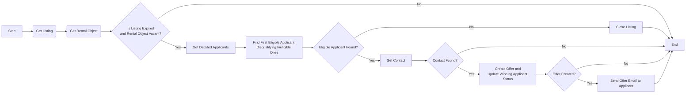
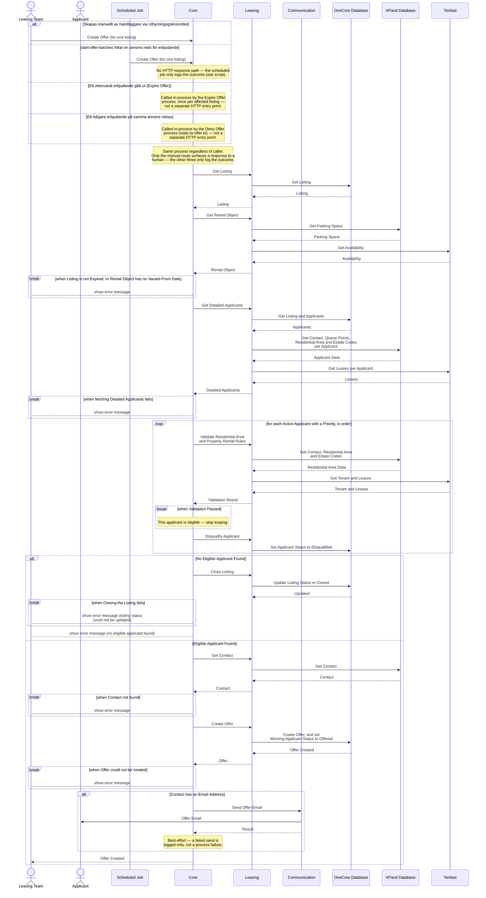

# Skapa Erbjudande för Poängsatt Bilplats

_Del av [processöversikten](./DOCS_Overview.md) för poängsatta bilplatser._

Ett erbjudande om en poängsatt bilplats skapas till nästa berättigade sökande i kön, för en annons vars visningsperiod gått ut — sökande som anmält intresse via [Create Note of Interest](./DOCS_Create_Note_of_Interest_for_Scored_Parking_Space.md). Processen kan initieras på fyra sätt:

- Manuellt av en handläggare via Uthyrningsgränssnittet
- Automatiskt av det schemalagda jobbet `start-offer-batches`, som hittar annonser vars visningsperiod precis gått ut och som ännu saknar erbjudande
- Automatiskt av [Expire Offer](./DOCS_Expire_Offer.md)-processen (`handle-expired-offers`), efter att ett obesvarat erbjudande gått ut
- Internt av [Deny Offer](./DOCS_Deny_Offer.md)-processen, när ett tidigare erbjudande på samma annons nekas

Oavsett hur den startar går processen igenom kölistan i prioritetsordning och diskvalificerar sökande som inte uppfyller områdes- eller fastighetsspecifika uthyrningsregler, tills en berättigad sökande hittas. Den sökanden får ett erbjudande via e-post, som kan [accepteras](./DOCS_Accept_Offer.md) eller [nekas](./DOCS_Deny_Offer.md). Hittas ingen berättigad sökande stängs annonsen.

## Flödesdiagram

Processens beslutslogik: vilka kontroller som styr om flödet går vidare till nästa steg, och vad som händer vid godkännande, nekande eller fel. System- och integrationsdetaljer är medvetet utelämnade här — se sekvensdiagrammet nedan för det.

## Sekvensdiagram

Vilka tjänster och externa system som anropas i varje steg, i vilken ordning, och var processen kan avbrytas vid en misslyckad kontroll. Täcker alla fyra ingångarna (handläggarinitierat via Uthyrningsgränssnittet, de två schemalagda jobben, och internt anrop från [Deny Offer](./DOCS_Deny_Offer.md)-processen), och visar att mikrotjänsten Leasing samt de externa systemen XPand och Tenfast är inblandade.

