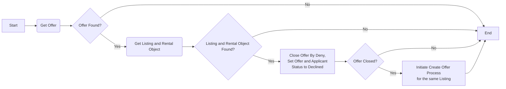

# Neka Erbjudande för Poängsatt Bilplats

_Del av [processöversikten](./DOCS_Overview.md) för poängsatta bilplatser._

En sökande nekar ett erbjudande om en poängsatt bilplats, skapat av [Create Offer](./DOCS_Create_Offer_for_Scored_Parking_Space.md)-processen — antingen själv via Mina Sidor eller å sökandens vägnar av en handläggare via Uthyrningsgränssnittet. Erbjudandet och sökandens ansökan uppdateras till nekad, och Create Offer-processen körs därefter på nytt för att skapa ett nytt erbjudande till nästa berättigade sökande i kön för samma annons. Se [Accept Offer](./DOCS_Accept_Offer.md) för den motsatta vägen.

## Flödesdiagram

Processens beslutslogik: vilka kontroller som styr om flödet går vidare till nästa steg, och vad som händer vid godkännande, nekande eller fel. System- och integrationsdetaljer är medvetet utelämnade här — se sekvensdiagrammet nedan för det.



## Sekvensdiagram

Vilka tjänster och externa system som anropas i varje steg, i vilken ordning, och var processen kan avbrytas vid en misslyckad kontroll. Täcker båda ingångarna (sökandens självbetjäning och handläggarinitierat via Uthyrningsgränssnittet), och visar att mikrotjänsten Leasing samt de externa systemen XPand och Tenfast är inblandade.

```mermaid
sequenceDiagram
    actor LeasingTeam as Leasing Team
    actor User as User
    participant Core as Core
    participant Leasing as Leasing
    participant OneCoreDB as OneCore Database
    participant XPandDB as XPand Database
    participant Tenfast as Tenfast

    alt Nekas manuellt av handläggare via Uthyrningsgränssnittet
        LeasingTeam ->> Core: Deny Offer
    else Nekas av sökanden via Mina Sidor
        User ->> Core: Deny Offer
    end
    note over Core: Mina Sidor-vägen är arkitekturellt stödd (samma<br/>endpoint, Keycloak-autentisering) men den delen är<br/>inte implementerad i denna kodbas. Responses below<br/>go back to whichever caller made this call, shown as User.

    Core ->> Leasing: Get Offer
    Leasing ->> OneCoreDB: Get Offer
    OneCoreDB -->> Leasing: Offer
    Leasing -->> Core: Offer

    break when Offer is not found
        Core-->User: show error message
    end

    Core ->> Leasing: Get Listing
    Leasing ->> OneCoreDB: Get Listing
    OneCoreDB -->> Leasing: Listing
    Leasing -->> Core: Listing

    Core ->> Leasing: Get Rental Object
    Leasing ->> XPandDB: Get Parking Space
    XPandDB -->> Leasing: Parking Space
    Leasing ->> Tenfast: Get Availability
    Tenfast -->> Leasing: Availability
    Leasing -->> Core: Rental Object

    break when Listing or Rental Object not found,<br/>or missing Residential Area Code
        Core-->User: show error message
    end

    Core ->> Leasing: Close Offer By Deny
    Leasing ->> OneCoreDB: Set Offer Status to Declined,<br/>and Applicant Status to OfferDeclined
    OneCoreDB -->> Leasing: Updated
    Leasing -->> Core: Result

    break when Closing the Offer fails
        Core-->User: show error message
    end

    Core ->> Core: Create Offer for this Listing<br/>(see Create Offer process)
    note over Core: Best-effort — if creating the next<br/>offer fails, it's logged only; denying<br/>this offer has already succeeded.

    Core -->> User: Deny Offer success!

```
