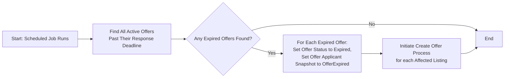
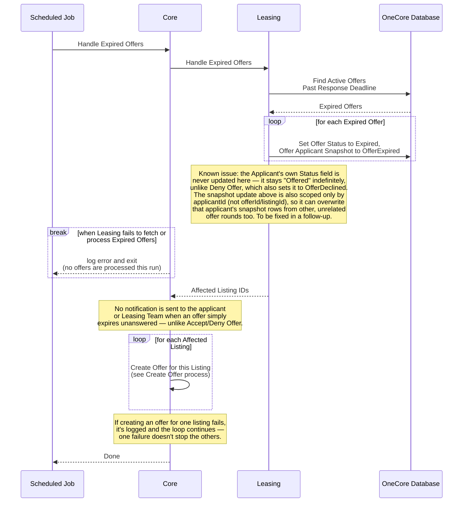

# Hantera Utgångna Erbjudanden (Expire Offer)

_Del av [processöversikten](./DOCS_Overview.md) för poängsatta bilplatser._

Ett schemalagt jobb letar systemvitt upp alla aktiva erbjudanden om poängsatta bilplatser vars svarsfrist har passerat utan att sökanden svarat. Erbjudandet och den tillhörande ansökan sätts till utgången status, och ett nytt erbjudande skapas därefter automatiskt till nästa berättigade sökande i kön för varje påverkad annons (se [Create Offer](./DOCS_Create_Offer_for_Scored_Parking_Space.md)-processen).

## Flödesdiagram

Processens beslutslogik: vilka kontroller som styr om flödet går vidare till nästa steg, och vad som händer vid godkännande, nekande eller fel. System- och integrationsdetaljer är medvetet utelämnade här — se sekvensdiagrammet nedan för det.

## Sekvensdiagram

Vilka tjänster som anropas i varje steg, i vilken ordning. Detta är ett schemalagt, systemvitt jobb utan mänsklig initierare — det körs inte via Uthyrningsgränssnittet eller Mina Sidor.

