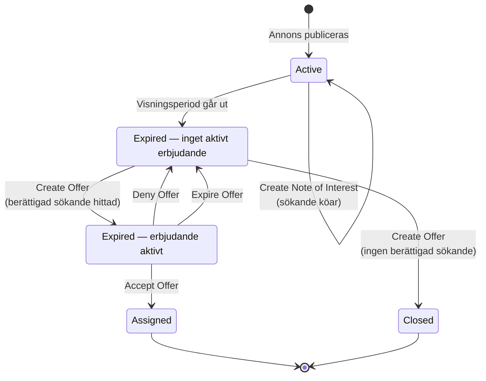

# Poängsatta Bilplatser — Processöversikt

De fem processerna i den här mappen styr hela livscykeln för en poängsatt (kösystem) bilplatsannons: från att en hyresgäst anmäler intresse, via att ett erbjudande skapas och besvaras, till att kontrakt skrivs eller annonsen stängs. Det här dokumentet visar hur de hänger ihop — se respektive dokuments egna flödesdiagram och sekvensdiagram för detaljer.

## Livscykel

Diagrammet visar annonsens (`Listing`) statusövergångar. `Expired` är samma databasstatus (`ListingStatus.Expired`) hela tiden erbjudanden skapas och besvaras — de två `Expired`-rutorna nedan skiljer bara på om ett erbjudande är aktivt just nu eller inte, det är ingen egen databasstatus.

Ett par saker som inte syns i diagrammet men är värda att känna till:

- **När ett erbjudande accepteras** nekas automatiskt alla _andra_ aktiva erbjudanden till samma sökande — oavsett vilken annons de gäller. Varje sådan nekning kör sin egen `ExpiredWithOffer → ExpiredNoOffer → ExpiredWithOffer`-cykel på sin respektive annons (se [Accept Offer](./DOCS_Accept_Offer.md)).
- **`Active`** motsvarar `ListingStatus.Active` (kod-kommentar: "Publicerad") — annonsen tar emot intresseanmälningar tills visningsperioden går ut.
- **Övergången `Active → Expired` sker helt utanför Core**, till skillnad från alla andra övergångar i diagrammet. Ett eget schemalagt jobb i leasing-tjänsten (`services/leasing/src/scripts/expire-listings.ts`) letar upp annonser där `PublishedTo` har passerat och sätter dem till `Expired` — inget av dokumenten i den här mappen beskriver det steget, eftersom det inte går via någon Core-orkestrerad process.

## Processer i ordning

| Process                                                                               | Vad den gör                                                                                               | Triggas av                                                                                                              |
| ------------------------------------------------------------------------------------- | --------------------------------------------------------------------------------------------------------- | ----------------------------------------------------------------------------------------------------------------------- |
| [Create Note of Interest](./DOCS_Create_Note_of_Interest_for_Scored_Parking_Space.md) | Sökande anmäler intresse för en publicerad annons och placeras i kön                                      | Sökande (Mina Sidor) eller handläggare (Uthyrningsgränssnittet)                                                         |
| [Create Offer](./DOCS_Create_Offer_for_Scored_Parking_Space.md)                       | Skapar ett erbjudande till nästa berättigade sökande i kön för en annons vars visningsperiod gått ut      | Handläggare (Uthyrningsgränssnittet), `start-offer-batches` (schemalagt), internt från Expire Offer eller Deny Offer    |
| [Accept Offer](./DOCS_Accept_Offer.md)                                                | Sökanden accepterar erbjudandet — kontrakt skapas, andra aktiva erbjudanden till samma sökande nekas      | Sökande (Mina Sidor — arkitekturellt stött, ej implementerad i denna kodbas) eller handläggare (Uthyrningsgränssnittet) |
| [Deny Offer](./DOCS_Deny_Offer.md)                                                    | Sökanden nekar erbjudandet — ett nytt erbjudande skapas till nästa sökande på samma annons                | Sökande (Mina Sidor — samma förbehåll som ovan) eller handläggare (Uthyrningsgränssnittet)                              |
| [Expire Offer](./DOCS_Expire_Offer.md)                                                | Ett obesvarat erbjudande går ut utan svar — ett nytt erbjudande skapas till nästa sökande på samma annons | Schemalagt jobb (`handle-expired-offers`) — inget mänskligt anrop                                                       |

## Motsvarande process för icke-poängsatta bilplatser

Icke-poängsatta (först till kvarn) bilplatser har ingen ansökan/erbjudande-cykel — kontraktet skapas direkt vid ansökan. Se [Create Lease for Non-Scored Parking Space](../external/DOCS_Create_Lease_for_None_Scored_Parking_Space.md).
