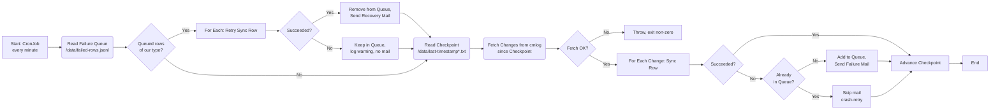

# Synk från XPand — Processöversikt

Så länge XPand fortfarande är systemet där handläggare skapar och ändrar kontakter och hyresavtal måste ändringarna föras vidare till de system som numera äger respektive data: **Tenfast** (avtal och hyresgäster), **Xledger** (kunder/ekonomi) och **Odoo** (hyresgäster i ärendehanteringen). Det görs av två fristående script i core-paketet som körs som Kubernetes CronJobs och pollar XPands ändringslogg `cmlog`.

Det här dokumentet beskriver den gemensamma mekaniken — se respektive dokument för vad varje script faktiskt synkar.

## Processer

| Process                                                  | Vad den gör                                                                  | Triggas av                                                        |
| -------------------------------------------------------- | ---------------------------------------------------------------------------- | ----------------------------------------------------------------- |
| [Synka Kontakter](./sync-contacts/DOCS_Sync_Contacts.md) | Ändrade kontakter i XPand skrivs vidare till Tenfast, Xledger och Odoo       | CronJob `sync-contacts` (`mimer-onecore-operations`), varje minut |
| [Synka Avtal](./sync-leases/DOCS_Sync_Leases.md)         | Tecknade, uppsagda och makulerade hyreskontrakt i XPand speglas till Tenfast | CronJob `sync-leases` (`mimer-onecore-operations`), varje minut   |

## Gemensam mekanik

Båda scripten är byggda över samma mönster. Skillnaden ligger i vilken `cmlog`-rad de läser, och vad de gör med den.

### cmlog som ändringskälla

XPand loggar varje ändring som en rad i tabellen `cmlog` med ett fritextfält `logmemo` och en tidsstämpel `logtime`. Det finns ingen event-buss och inga webhooks — synken består av att läsa nya rader och tolka texten:

- **sync-contacts** läser rader som börjar med `Kontakt ` och plockar ut kontaktkoden. Flera ändringar på samma kontakt inom ett fönster kollapsas till en enda synk (senaste `logtime` vinner), eftersom hela kontakten hämtas färskt ändå.
- **sync-leases** läser rader som börjar med `Hyreskontrakt ` och klassificerar varje rad till `create`, `terminate` eller `void` utifrån vilket fält som ändrats. Här kollapsas ingenting — varje händelse spelas upp i kronologisk ordning, så att Tenfast hamnar i samma sluttillstånd som XPand även när ett avtal både skapats och sagts upp inom samma fönster.

`cmlog.logtime` är en `datetime` utan tidszon som XPand fyller med svensk lokaltid. Jämförelsen mot `since` fungerar därför bara så länge SQL Server-sessionen kör svensk tid.

### Checkpoint på disk

Varje script håller sin senast behandlade tidsstämpel i en fil på en PersistentVolumeClaim monterad på `/data`:

| Script        | Checkpoint-fil                    | PVC                   |
| ------------- | --------------------------------- | --------------------- |
| sync-contacts | `/data/last-timestamp.txt`        | `sync-contacts-state` |
| sync-leases   | `/data/last-timestamp-leases.txt` | `sync-leases-state`   |

Filen skrivs efter **varje** rad (skriv till `.tmp` + `rename`, så den aldrig blir halvskriven), inte i slutet av körningen. Kraschar jobbet mitt i återupptas nästa körning där det stannade. Saknas filen — första körningen, eller ny PVC — synkas _allt_ från XPands historik, vilket är avsiktligt men tungt.

Notera att checkpointen flyttas fram även när raden misslyckades. Det är felkön nedan, inte tidsstämpeln, som ser till att raden inte tappas bort.

### Felkö och återförsök

Rader som misslyckas skrivs till `/data/failed-rows.jsonl` (en JSON per rad) tillsammans med felmeddelandet, via den delade modulen [`shared/failed-sync-queue.ts`](./shared/failed-sync-queue.ts). Varje körning börjar med att tömma kön: lyckas raden tas den bort, annars ligger den kvar till nästa minut. Det finns ingen maxgräns för antal försök och ingen backoff — en rad som aldrig kan lyckas ligger kvar tills någon åtgärdar den manuellt.

Köraden nycklas på innehållet (`contactCode:timestamp` respektive `leaseId:action:timestamp`), vilket gör återförsöken idempotenta gentemot kön: samma rad kan inte läggas till två gånger.

Posterna är taggade med `type` (`contact` eller `lease`) och varje script hoppar över poster av fel typ. I praktiken har scripten separata PVC:er och läser aldrig varandras kö — taggningen är en kvarleva från när filnamnet delades.

### Notifieringar via e-post

Fel mejlas till adressen i `config.emailAddresses.xpandSync` via Communication-tjänsten, med två sorters utskick:

- **Nytt fel** — skickas _en gång_ när raden läggs i kön. Misslyckas samma rad igen vid nästa körning skickas inget nytt mejl.
- **Återhämtning** — skickas när en tidigare felande rad äntligen lyckas, med ursprungsfelet som referens.

Ett misslyckat mejlutskick loggas men fäller aldrig synken. Är adressen inte konfigurerad loggas en varning och notifieringen hoppas över helt.

### Schemaläggning

Schemaläggningen ligger inte i onecore-repot utan i `mimer-onecore-operations` (`apps/onecore/core/synccontactscronjob.yaml` och `syncleasescronjob.yaml`). Båda CronJobs kör varje minut (`* * * * *`) med `concurrencyPolicy: Forbid`, så en långsam körning aldrig överlappar nästa.

Båda är `suspend: true` som utgångsläge och aktiveras per miljö genom en Kustomize-patch — i skrivande stund bara i dev-miljön `epic-avtal-49`. I stage tas `sync-contacts` bort helt.

## Gemensamt flödesdiagram

Skelettet som båda scripten följer. Vad "Sync Row" faktiskt gör skiljer sig åt — se respektive dokument.

