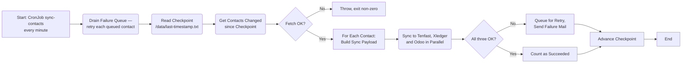
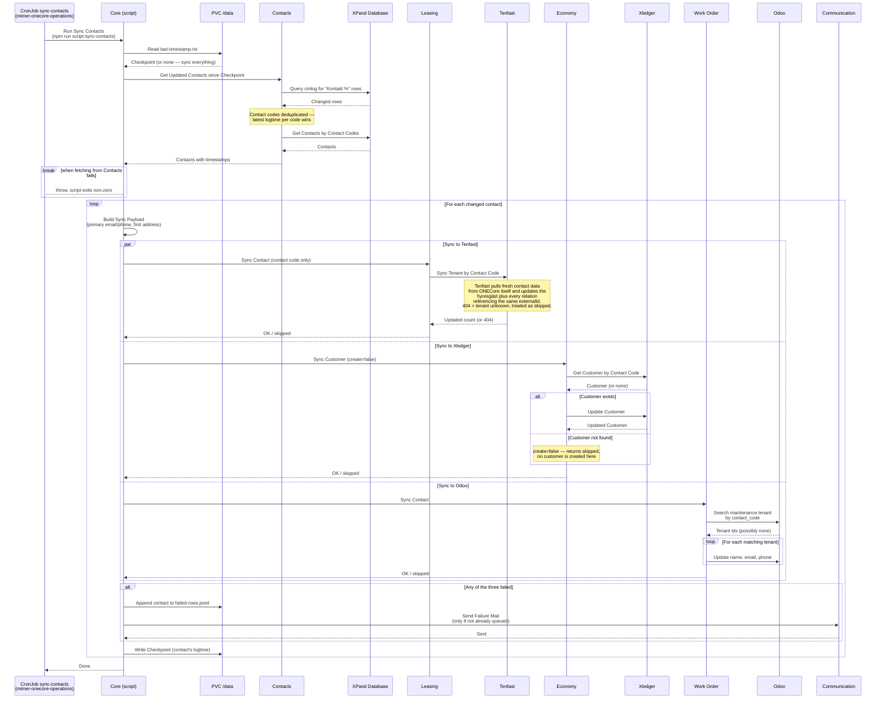

# Synka Kontakter från XPand

_Del av [processöversikten](../DOCS_Sync_Overview.md) för XPand-synk. Där beskrivs den gemensamma mekaniken — checkpoint, felkö, notifieringar och schemaläggning — som inte upprepas här._

Ett fristående script (`core/src/scripts/sync-contacts/index.ts`) hämtar de kontakter som ändrats i XPand sedan förra körningen och skriver dem vidare till de tre system som håller egna kopior av kontaktdata: **Tenfast** (hyresgäster), **Xledger** (kunder) och **Odoo** (hyresgäster i ärendehanteringen). XPand är källan; de tre målen uppdateras, aldrig tvärtom.

Scriptet körs som Kubernetes CronJobbet `sync-contacts` varje minut. Se [processöversikten](../DOCS_Sync_Overview.md#schemaläggning) för schemaläggning och miljöer.

## Vad som synkas

Contacts-tjänsten returnerar hela `Contact`-objektet. Core plattar ut det till en synkpayload (`payload.ts`) och skickar sedan olika delmängder till olika mål:

| Fält                      | Tenfast | Xledger | Odoo |
| ------------------------- | :-----: | :-----: | :--: |
| `fullName`                |    –    |    ✓    |  ✓   |
| `emailAddress` (primär)   |    –    |    ✓    |  ✓   |
| `phoneNumber` (primär)    |    –    |    –    |  ✓   |
| `street`/`zipCode`/`city` |    –    |    ✓    |  –   |

Tenfast-kolumnen är tom med flit: dit skickas **bara kontaktkoden**. Tenfast hämtar sedan själv färska kontaktuppgifter från OneCore och uppdaterar hyresgästen samt alla relationer som pekar på samma `externalId`. Övriga två får payloaden skickad till sig.

`fullName` är personens `fullName` för privatpersoner och organisationens `name` för företag. E-post och telefon väljs som den post som är markerad `isPrimary`, annars den första i listan. Adressen tas från `addresses[0]`.

## Målsystemens beteende när kontakten är okänd

De tre målen svarar olika på en kontakt de inte känner igen, men gemensamt är att ingen av dem skapar något nytt i det här flödet:

- **Tenfast** — svarar 404, vilket tolkas som `skipped` och räknas som lyckat.
- **Xledger** — anropas medvetet med `create=false`. Saknas kunden returneras `null` (`skipped`). En kontakt som är helt ny i XPand når alltså aldrig Xledger via det här scriptet; den skapas först när den behövs, t.ex. som annan fakturamottagare i [sync-leases](../sync-leases/DOCS_Sync_Leases.md).
- **Odoo** — söker upp `maintenance.tenant` på `contact_code`. Hittas ingen loggas det och raden räknas som lyckad. Hittas flera uppdateras samtliga.

## Felhantering

De tre anropen görs parallellt (`Promise.all`) och **alla tre måste lyckas** för att raden ska räknas som synkad. Misslyckas något av dem hamnar hela raden i felkön med ett felmeddelande som anger status per mål (`tenfast=… xledger=… odoo=…`).

Det innebär att ett återförsök kör om alla tre, även de som redan lyckats. Det är ofarligt eftersom samtliga tre operationer är rena uppdateringar av befintlig data och därmed idempotenta.

## Flödesdiagram

Processens beslutslogik. System- och integrationsdetaljer är medvetet utelämnade här — se sekvensdiagrammet nedan för det. Den gemensamma kö- och checkpointhanteringen finns i [processöversiktens flödesdiagram](../DOCS_Sync_Overview.md#gemensamt-flödesdiagram).

## Sekvensdiagram

Vilka tjänster som anropas i varje steg, i vilken ordning. Detta är ett fristående script i core-paketet, inte en HTTP-endpoint — det körs utanför Koa-servern, som ett eget engångs-Kubernetes-Job skapat av CronJobbet, utan mänsklig initierare. Kö-tömningen i början av körningen är utelämnad; den kör exakt samma anropskedja som visas här.

