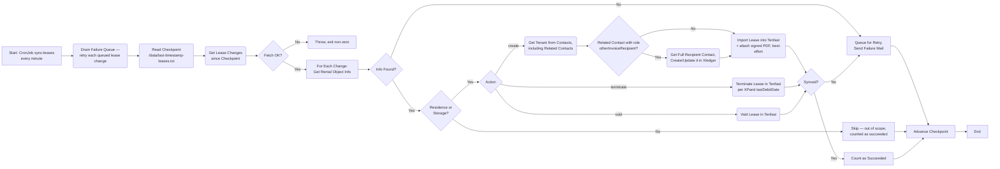
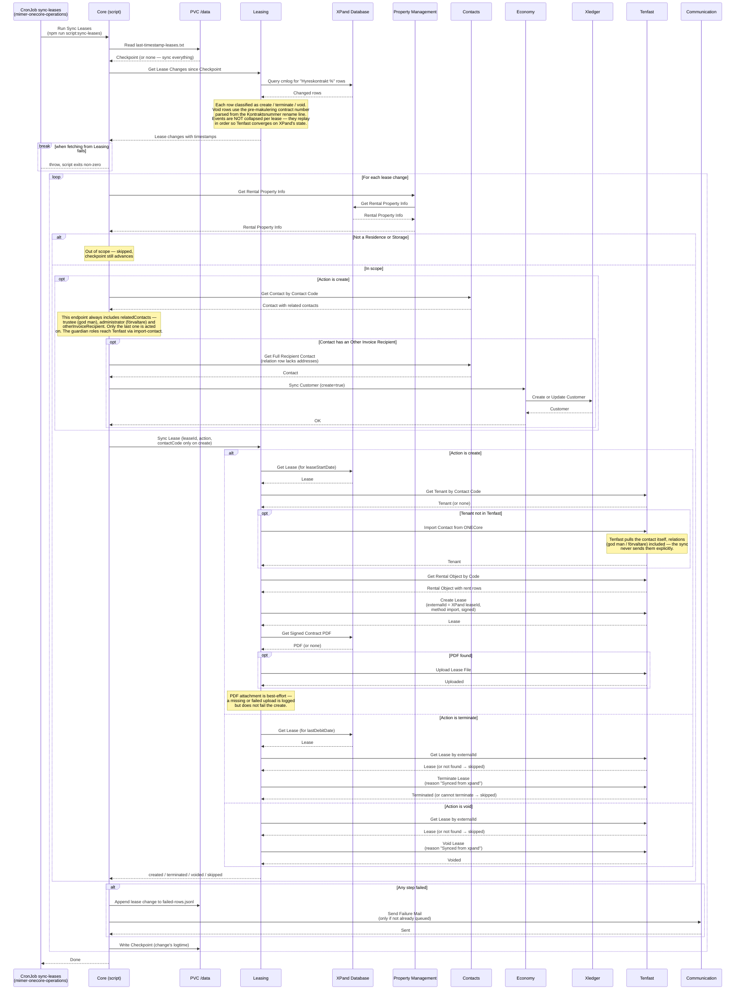

# Synka Avtal från XPand

_Del av [processöversikten](../DOCS_Sync_Overview.md) för XPand-synk. Där beskrivs den gemensamma mekaniken — checkpoint, felkö, notifieringar och schemaläggning — som inte upprepas här._

Ett fristående script (`core/src/scripts/sync-leases/index.ts`) speglar hyreskontrakt från XPand till **Tenfast**. Så länge handläggare fortfarande tecknar, säger upp och makulerar avtal i XPand är det XPand som är sanningskällan; scriptet ser till att Tenfast konvergerar mot samma tillstånd.

Till skillnad från [kontaktsynken](../sync-contacts/DOCS_Sync_Contacts.md), som bara uppdaterar befintlig data, **skapar** den här synken avtal i Tenfast — inklusive hyresgäst och hyresrader — och avslutar dem.

Scriptet körs som Kubernetes CronJobbet `sync-leases` varje minut. Se [processöversikten](../DOCS_Sync_Overview.md#schemaläggning) för schemaläggning och miljöer.

## Vilka händelser som plockas upp

Leasing-tjänsten läser `cmlog`-rader som börjar med `Hyreskontrakt ` och klassificerar varje rad utifrån vilket fält som ändrats från tomt till ett datum:

| `logmemo`-fält som satts | Action      | Vad som händer i Tenfast                     |
| ------------------------ | ----------- | -------------------------------------------- |
| `Undertecknat`           | `create`    | Avtalet importeras (med hyresgäst och hyror) |
| `Uppsagt datum`          | `terminate` | Avtalet sägs upp per XPands `lastDebitDate`  |
| `Makulerat datum`        | `void`      | Avtalet makuleras                            |

Rader som inte matchar något av mönstren ignoreras, liksom rader som inte gäller `Bostadskontrakt`, `Lokalkontrakt` eller `Garagekontrakt`. `leaseId` och kontaktkod plockas ur radens första rad, och `rentalObjectId` härleds genom att klippa bort `/XX`-suffixet från `leaseId`.

**Makulerade avtal byter namn i XPand.** Kontraktsnumret får ett M-suffix i samma ändring, så numret i memots första rad är det nya — medan Tenfast känner avtalet under det gamla. Därför läses det ursprungliga numret ut ur rename-raden (`Värdet i fältet 'Kontraktsnummer' ändrat från … till …`) och används i stället. En Makulerat-rad utan rename-rad går inte att koppla till rätt avtal och hoppas över med en varning.

Händelser slås **inte** ihop per avtal. Alla spelas upp i kronologisk ordning, så att ett avtal som både tecknats och sagts upp inom samma synkfönster hamnar rätt i Tenfast.

## Vilka objekt som är i scope

Innan något skickas till Tenfast hämtar core objektinformation från XPand via Property Management och filtrerar:

- **Lägenhet** — synkas.
- **Lokal** vars underliggande objekt är av typen **Förråd** — synkas.
- Allt annat — hoppas över. Raden loggas och räknas som lyckad, checkpointen flyttas fram.

Filtret är alltså snävare än vad `cmlog`-parsningen släpper igenom: garage- och lokalkontrakt plockas upp ur loggen men faller bort här.

Går objektinformationen inte att hämta räknas raden däremot som ett **fel** och hamnar i felkön — skillnaden mot "utanför scope" är avsiktlig.

## Relaterade kontakter

Vid `create` hämtas hyresgästen via `GET /contacts/{contactCode}`, som till skillnad från synk-endpointen [alltid tar med `relatedContacts`](../DOCS_Sync_Overview.md#relaterade-kontakter). Scriptet har alltså god man, förvaltare och annan fakturamottagare tillgängliga här — men agerar bara på en av dem.

| Roll                              | Vad synken gör med den                                    |
| --------------------------------- | --------------------------------------------------------- |
| `otherInvoiceRecipient`           | Skapas/uppdateras som kund i Xledger innan avtalet skapas |
| `trustee` (god man)               | Läses men används inte                                    |
| `administrator` (förvaltare)      | Läses men används inte                                    |
| `*For`-rollerna (omvänd riktning) | Läses men används inte                                    |

God man och förvaltare hamnar ändå i Tenfast, men via en annan väg: när avtalet skapas importeras hyresgästen med `import-contact`, och Tenfast hämtar då kontaktuppgifterna inklusive relationer från OneCore på egen hand. Synken skickar dem aldrig explicit.

### Annan fakturamottagare

Finns en `otherInvoiceRecipient` hämtas hela den kontakten separat — den slimmade relationsposten saknar adressuppgifterna Xledger behöver — och synkas dit med `create=true`. Mottagaren ska finnas som kund i Xledger innan avtalet börjar aviseras, även om hen aldrig varit hyresgäst. Misslyckas det avbryts hela avtalssynken och raden köas.

Det här är den enda platsen i XPand-synken där en kund faktiskt _skapas_ i Xledger; [sync-contacts](../sync-contacts/DOCS_Sync_Contacts.md) kör medvetet med `create=false`.

## Vad Tenfast gör per action

### create

1. Hyresgästen slås upp i Tenfast på kontaktkod. Saknas den importeras den från OneCore (`import-contact`).
2. Hyresobjektet slås upp på objektkod — hittas det inte avbryts importen.
3. Avtalet skapas med `method: "import"` och `signed: true`, med XPands `leaseId` som `externalId` (det är den nyckel `terminate` och `void` senare slår upp på), startdatum från XPands `leaseStartDate`, och hyresrader kopierade från hyresobjektet.
4. Det signerade kontraktet hämtas som PDF ur XPands dokumenttabeller och bifogas avtalet. **Detta steg är best-effort** — saknad eller misslyckad PDF loggas som varning men fäller inte synken, eftersom avtalet redan finns i Tenfast.

Saknar avtalet `leaseStartDate` i XPand, eller finns det inte alls där, returnerar Leasing 400 respektive 404 och raden hamnar i felkön.

### terminate

Slutdatumet hämtas från XPands `lastDebitDate` (saknas det blir det 400). Avtalet slås upp i Tenfast på `externalId` och sägs upp med `reason: "Synced from xpand"`, utan avisering till hyresgästen och markerat som redan hanterat.

### void

Avtalet slås upp på `externalId` och makuleras med `reason: "Synced from xpand"`.

För både `terminate` och `void` gäller att ett avtal som inte finns i Tenfast ger `skipped`, inte fel — typiskt ett avtal som aldrig kom in i Tenfast för att det låg utanför scope. Tenfast kan också svara att avtalet inte _kan_ sägas upp, vilket likaså behandlas som `skipped`.

## Flödesdiagram

Processens beslutslogik. System- och integrationsdetaljer är medvetet utelämnade här — se sekvensdiagrammet nedan för det. Den gemensamma kö- och checkpointhanteringen finns i [processöversiktens flödesdiagram](../DOCS_Sync_Overview.md#gemensamt-flödesdiagram).

## Sekvensdiagram

Vilka tjänster som anropas i varje steg, i vilken ordning. Detta är ett fristående script i core-paketet, inte en HTTP-endpoint — det körs utanför Koa-servern, som ett eget engångs-Kubernetes-Job skapat av CronJobbet, utan mänsklig initierare. Kö-tömningen i början av körningen är utelämnad; den kör exakt samma anropskedja som visas här.

