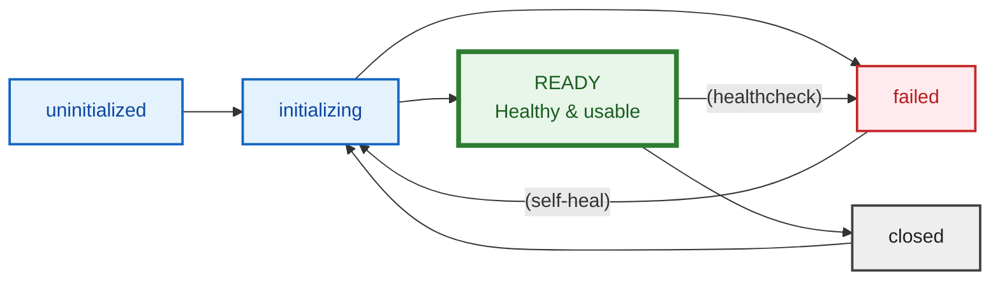

# ONECore - Common Utilities

ONECore common utilities

## Overview

- [Logger](#logger)
- [loggedAxios](#loggedaxios)
- [Healthcheck](#building-blocks-for-health-check-service-endpoints)
- [Resource](#resource)

### Logger

A logger based on Pino that logs to the console and to ElasticSearch. When logging from inside route handlers in Koa, a correlation id is automatically appended that will stay the same during a request.

If the ElasticSearch instance is or becomes unreachable, the application will continue running an still log to stdout.

#### General use

```
import { logger } from 'onecore-utilities'

logger.warn(aMessage)
logger.info(anObject, aMessage)
```

#### Koa request logging

`loggerMiddlewares.pre` will log the start of all incoming requests.<br>
`loggerMiddlewares.post` will log the completion of all incoming requests.

```
import { loggerMiddlewares } from 'onecore-utilities'

// Log the start and completion of all incoming requests
app.use(loggerMiddlewares.pre)
app.use(loggerMiddlewares.post)
```

The pre middleware automatically creates a correlationId (UUID) and attaches it to the ctx object as ctx.correlationId. All logging inside a route handler (and any files used by it) will automatically get the correlationId appended.

#### Configuration

Set environment variable `ELASTICSEARCH_LOGGING_HOST` to the full url of your ElasticSearch server.<br>
Set environment variable `APPLICATION_NAME` to the name of the application.

### loggedAxios

A standard Axios with interceptors for request and response that logs all requests and their completions to logger, with a subset of fields from the Axios request and response objects and a correlationId.

#### Configuration

Set environment variable `ELASTICSEARCH_LOGGING_HOST` to the full url of your ElasticSearch server.<br>
Set environment variable `APPLICATION_NAME` to the name of the application.

loggedAxios will automatically append correlationId from the store, append it to its logging and automatically add the header `x-correlation-id` to all its requests, to make sure the id propagates to integrated services.

#### General use

Use as you would use standard Axios.

```
import { loggedAxios as axios } from 'onecore-utilities'

const response = await axios('http://localhost')
```

#### Testing

In unit tests, you usually want the logger to be mocked away. There are multiple reasons for this - one is that the logger will try to connect to ElasticSearch, which if it succeeds leaves an open handle that will keep jest from finishing. Another is that the logger's console output will seriously clutter the test runner output.

If you are only using the logger, mock that away:

```
jest.mock('@onecore/utilities', () => {
  return {
    logger: {
      debug: () => { return },
      log: () => { return },
      info: () => { return },
      warn: () => { return },
      error: () => { return },
    },
  }
})
```

If you are using loggedAxios you will also have to mock that away, since it uses the logger. The easiest way to do this is to replace it with regular Axios and then mock that as you would usually mock Axios (just make sure it's the same version as the one used by loggingAxios):

```ts
import axios from 'axios'
jest.mock('@onecore/utilities', () => {
  return {
    logger: {
      debug: () => { return },
      log: () => { return },
      info: () => { return },
      warn: () => { return },
      error: () => { return },
    },
    loggedAxios: axios,
    axiosTypes: axios,
  }
})
```

### Building blocks for Health-check service endpoints

This module provides re-useable building blocks for creating health-check service endpoints for
ONECore service applications:

```ts
import KoaRouter from '@koa/router'

import {
  DbResource,
  collectDbPoolMetrics,
  HealthCheckTarget,
  SystemHealth,
  pollSystemHealth,
  probe,
  probeResource,
} from '@onecore/utilities'

import { AppInfrastructure } from '@src/context'

const healthChecks: Map<string, SystemHealth> = new Map()

export const routes = (router: OkapiRouter, infra: AppInfrastructure) => {
  const { xpandDbResource, bareKnexInstance } = infra

  const CONNECTIONS: DbResource[] = [
    
    // Resource<Knex> can be directly passed here, as Resource instances are always named
    xpandDb, 
    
    // Bare instances need to be wrapped in a DbConnection shape
    {
      name: 'Some DB Connection',
      connection: bareKnexInstance
    }
  ]

  const subsystems: HealthCheckTarget[] = [
    // Resource<any> performs its own out-of-band health checks and do not need
    // noisy config for name, intervals and method of health checking, and can
    // simply pass the Resource instance to `probeResource`
    //
    // The health-check service does not initiate health checks and do not require
    // the endpoint to be polled to transition to a non-ready state.
    {
      probe: async (): Promise<SystemHealth> => {
        return probeResource(xpandDb, healthChecks)
      },
    },
    // Non-Resource constructs that require health-checks can be passed to `probe`
    // along with name, check interval and check strategy.
    //
    // These health-checks are perform in request-time whenever a result is older
    // than the interval.
    {
      probe: async (): Promise<SystemHealth> => {
        return probe(
          config.health.someDatabase.systemName,
          healthChecks,
          config.health.someDatabase.minimumMinutesBetweenRequests,
          async () => {
            await bareKnexInstance.table('table').limit(1)
          }
        )
      }
    }
  ]

  // `pollSystemHealth` generates a response body for all health checks defined
  router.get('/health', {}, async (ctx) => {
    ctx.body = await pollSystemHealth('contacts', subsystems)
  })

  // `collectDbPoolMetrics` generates a response body for all DbResource entries
  // in CONNECTIONS (Resource<Knex> or Knex)
  router.get('/health/db', {}, async (ctx) => {
    ctx.body = collectDbPoolMetrics(CONNECTIONS)
  })
}

```

### Resource

This module provides a small but robust Resource abstraction for managing external dependencies
such as databases, caches, message brokers, or other long-lived services that:

- Require monitoring
- May enter an invalid state on network outage/resource unavailability
- May not be available at application startup
- May benefit from fail-fast semantics when unavailable

Benefits:
- Health and recovery happens out of band
- Uses fail-fast semantics on attempts to use a resource that is known to be unavailable

#### Core idea

A `Resource<T>` wraps a single underlying dependency instance and manages:
- Life-cycle (Tracking `status`, Construction via `init` and teardown via `close`)
- Background tracking of resource health via periodic health checks
- A single method, `.get()`, to obtain the healthy resource instance
- `.get()` immediately throws a ResourceNotReady error when unavailable, before any I/O is attempted.
- Configurable "self-healing" when an outage is detected.

Consumers *never* perform health checks or retries manually, and simply deny service until
the Resource returns to a `ready` state.

#### Resource life-cycle



#### Usage

A resource is defined with `makeResource`:

```ts
// A resource is created once and only once in the life-cycle of an application
const xpandDb = makeResource<Knex>({
  name: 'Xpand database',
  logger: <logger instance>,
  initialize: async () => {
    return knex({ ...<connection details> })
  }
  healthcheck: {
    interval: 1,
    intervalUnit: 'm'
    check: async (instance: Knex) => {
      await instance.raw('SELECT 1')
      return true
    }
  },
  heal: {
    strategy: 'exponential-backoff'
  },
  teardown: async (instance: Knex) => {
    await knex.destroy()
  }
})
```

Or in the actual case of Knex, preferrably with `makeKnexResource` that uses (overrideable) 
platform-wide defaults for pool size, healthcheck and heal strategy:

```ts
const xpandDb = makeKnexResource({
  name: 'Xpand database',
  logger: <logger instance>,
  config: <connection details>
})
```

Usage in the application then uses `.get()` to access the resource, which returns the Resource instance
or immediately throws a ResourceNotReady error if unavailable.

```ts
// Elsewhere, in application code...
function getAllTheThings() {
  return await xpandDb.get().from('table').select('col1', 'col2')
}

```


## Development

### Requirements

We use pnpm as our package manager: https://pnpm.io/installation

This application requires the following to be installed on your system:

- **nvm**
- **pnpm**
- **Node.js**

### Install Instructions

#### Install runtime

Install the required node version, if not already installed.

```sh
$ nvm install
```

Activate the required node version.

```sh
$ nvm use
```

#### Install dependencies

Install dependencies

```sh
$ pnpm run install
```

## License

© 2025 Bostads AB Mimer. [AGPL-3.0-only Licensed](./LICENSE)
